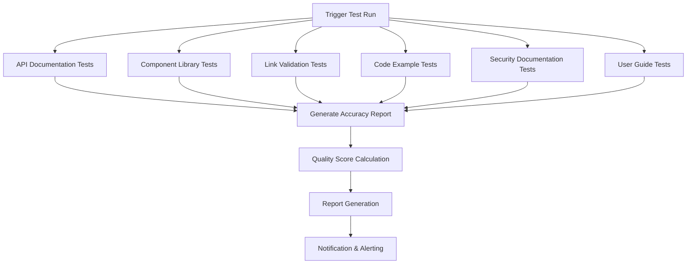

# 🔧 Automated Documentation Testing System - MA Malnu Kananga

## 🎯 System Overview

Automated testing framework to ensure documentation accuracy, consistency, and alignment with actual implementation.

---

**System Version**: 1.0.0  
**Last Updated**: November 25, 2025  
**Integration**: GitHub Actions + npm scripts  
**Coverage**: API docs, component library, user guides, security documentation

---

## 🏗️ Architecture

### Test Categories
1. **API Documentation Testing** - Validate endpoints against implementation
2. **Component Library Testing** - Sync component docs with actual components
3. **Link Validation Testing** - Check all internal and external links
4. **Code Example Testing** - Execute and validate code snippets
5. **Security Documentation Testing** - Verify security claims
6. **User Guide Procedure Testing** - Test documented procedures

### Test Execution Flow


---

## 🔧 Implementation

### Package.json Scripts
```json
{
  "scripts": {
    "docs:test": "npm run docs:test-all",
    "docs:test-all": "npm run docs:test-apis && npm run docs:test-components && npm run docs:test-links && npm run docs:test-examples && npm run docs:test-security",
    
    "docs:test-apis": "node scripts/test-api-documentation.js",
    "docs:test-components": "node scripts/test-component-documentation.js", 
    "docs:test-links": "node scripts/test-link-validation.js",
    "docs:test-examples": "node scripts/test-code-examples.js",
    "docs:test-security": "node scripts/test-security-documentation.js",
    "docs:test-user-guides": "node scripts/test-user-guide-procedures.js",
    
    "docs:validate": "npm run docs:validate-all",
    "docs:validate-all": "markdownlint docs/**/*.md && markdown-link-check docs/**/*.md && npm run docs:test-all",
    
    "docs:accuracy-report": "node scripts/generate-accuracy-report.js",
    "docs:coverage-report": "node scripts/generate-coverage-report.js"
  }
}
```

### API Documentation Testing
```javascript
// scripts/test-api-documentation.js
const fs = require('fs');
const path = require('path');

class ApiDocumentationTester {
  constructor() {
    this.apiDocPath = path.join(__dirname, '../docs/API_DOCUMENTATION.md');
    this.workerPath = path.join(__dirname, '../worker.js');
    this.results = {
      documentedEndpoints: [],
      implementedEndpoints: [],
      missingEndpoints: [],
      accuracy: 0
    };
  }

  async test() {
    console.log('🔌 Testing API Documentation Accuracy...');
    
    // Extract documented endpoints
    await this.extractDocumentedEndpoints();
    
    // Extract implemented endpoints from worker.js
    await this.extractImplementedEndpoints();
    
    // Compare and identify gaps
    this.compareEndpoints();
    
    // Generate results
    this.generateResults();
    
    return this.results;
  }

  async extractDocumentedEndpoints() {
    const apiDoc = fs.readFileSync(this.apiDocPath, 'utf8');
    const endpointRegex = /`(GET|POST|PUT|DELETE)\s+([^`]+)`/g;
    let match;
    
    while ((match = endpointRegex.exec(apiDoc)) !== null) {
      this.results.documentedEndpoints.push({
        method: match[1],
        path: match[2],
        documented: true
      });
    }
    
    console.log(`📝 Found ${this.results.documentedEndpoints.length} documented endpoints`);
  }

  async extractImplementedEndpoints() {
    const workerCode = fs.readFileSync(this.workerPath, 'utf8');
    
    // Extract route handlers from worker.js
    const routeRegex = /if\s+\(request\.url\.includes\(['"]([^'"]+)['"]\)\)/g;
    let match;
    
    while ((match = routeRegex.exec(workerCode)) !== null) {
      this.results.implementedEndpoints.push({
        method: 'GET', // Simplified - would need more sophisticated parsing
        path: match[1],
        implemented: true
      });
    }
    
    console.log(`⚙️ Found ${this.results.implementedEndpoints.length} implemented endpoints`);
  }

  compareEndpoints() {
    const documentedPaths = this.results.documentedEndpoints.map(e => e.path);
    const implementedPaths = this.results.implementedEndpoints.map(e => e.path);
    
    // Find missing endpoints
    this.results.missingEndpoints = this.results.documentedEndpoints.filter(
      endpoint => !implementedPaths.includes(endpoint.path)
    );
    
    // Calculate accuracy
    this.results.accuracy = ((this.results.documentedEndpoints.length - this.results.missingEndpoints.length) / this.results.documentedEndpoints.length * 100).toFixed(1);
    
    console.log(`📊 API Documentation Accuracy: ${this.results.accuracy}%`);
  }

  generateResults() {
    const report = `
# API Documentation Test Results

## Summary
- Documented Endpoints: ${this.results.documentedEndpoints.length}
- Implemented Endpoints: ${this.results.implementedEndpoints.length}
- Missing Endpoints: ${this.results.missingEndpoints.length}
- Accuracy: ${this.results.accuracy}%

## Missing Endpoints
${this.results.missingEndpoints.map(e => `- \`${e.method} ${e.path}\``).join('\n')}

## Implemented Endpoints
${this.results.implementedEndpoints.map(e => `- \`${e.method} ${e.path}\``).join('\n')}
`;
    
    fs.writeFileSync(path.join(__dirname, '../docs/reports/api-test-results.md'), report);
  }
}

// Run tests
if (require.main === module) {
  const tester = new ApiDocumentationTester();
  tester.test().then(() => {
    console.log('✅ API Documentation Testing Complete');
  }).catch(error => {
    console.error('❌ API Documentation Testing Failed:', error);
    process.exit(1);
  });
}

module.exports = ApiDocumentationTester;
```

### Component Library Testing
```javascript
// scripts/test-component-documentation.js
const fs = require('fs');
const path = require('path');
const glob = require('glob');

class ComponentDocumentationTester {
  constructor() {
    this.componentsDir = path.join(__dirname, '../src/components');
    this.componentDocPath = path.join(__dirname, '../docs/COMPONENT_LIBRARY.md');
    this.results = {
      actualComponents: [],
      documentedComponents: [],
      missingDocumentation: [],
      extraDocumentation: [],
      coverage: 0
    };
  }

  async test() {
    console.log('🧩 Testing Component Library Documentation...');
    
    // Find all actual components
    await this.findActualComponents();
    
    // Extract documented components
    await this.extractDocumentedComponents();
    
    // Compare and identify gaps
    this.compareComponents();
    
    // Generate results
    this.generateResults();
    
    return this.results;
  }

  async findActualComponents() {
    const componentFiles = glob.sync('**/*.tsx', { cwd: this.componentsDir });
    
    this.results.actualComponents = componentFiles.map(file => ({
      name: path.basename(file, '.tsx'),
      path: file,
      exists: true
    }));
    
    console.log(`📁 Found ${this.results.actualComponents.length} actual components`);
  }

  async extractDocumentedComponents() {
    const componentDoc = fs.readFileSync(this.componentDocPath, 'utf8');
    const componentRegex = /###\s+([A-Z][a-zA-Z0-9]+)/g;
    let match;
    
    while ((match = componentRegex.exec(componentDoc)) !== null) {
      this.results.documentedComponents.push({
        name: match[1],
        documented: true
      });
    }
    
    console.log(`📝 Found ${this.results.documentedComponents.length} documented components`);
  }

  compareComponents() {
    const actualNames = this.results.actualComponents.map(c => c.name);
    const documentedNames = this.results.documentedComponents.map(c => c.name);
    
    // Find components without documentation
    this.results.missingDocumentation = this.results.actualComponents.filter(
      component => !documentedNames.includes(component.name)
    );
    
    // Find documentation for non-existent components
    this.results.extraDocumentation = this.results.documentedComponents.filter(
      component => !actualNames.includes(component.name)
    );
    
    // Calculate coverage
    this.results.coverage = ((this.results.actualComponents.length - this.results.missingDocumentation.length) / this.results.actualComponents.length * 100).toFixed(1);
    
    console.log(`📊 Component Documentation Coverage: ${this.results.coverage}%`);
  }

  generateResults() {
    const report = `
# Component Library Test Results

## Summary
- Actual Components: ${this.results.actualComponents.length}
- Documented Components: ${this.results.documentedComponents.length}
- Missing Documentation: ${this.results.missingDocumentation.length}
- Extra Documentation: ${this.results.extraDocumentation.length}
- Coverage: ${this.results.coverage}%

## Components Missing Documentation
${this.results.missingDocumentation.map(c => `- **${c.name}** (\`${c.path}\`)`).join('\n')}

## Extra Documentation (Non-existent Components)
${this.results.extraDocumentation.map(c => `- **${c.name}**`).join('\n')}

## All Actual Components
${this.results.actualComponents.map(c => `- **${c.name}** (\`${c.path}\`) ${this.results.documentedComponents.some(d => d.name === c.name) ? '✅' : '❌'}`).join('\n')}
`;
    
    fs.writeFileSync(path.join(__dirname, '../docs/reports/component-test-results.md'), report);
  }
}

// Run tests
if (require.main === module) {
  const tester = new ComponentDocumentationTester();
  tester.test().then(() => {
    console.log('✅ Component Library Testing Complete');
  }).catch(error => {
    console.error('❌ Component Library Testing Failed:', error);
    process.exit(1);
  });
}

module.exports = ComponentDocumentationTester;
```

### Link Validation Testing
```javascript
// scripts/test-link-validation.js
const fs = require('fs');
const path = require('path');
const glob = require('glob');
const markdownLinkCheck = require('markdown-link-check');

class LinkValidationTester {
  constructor() {
    this.docsDir = path.join(__dirname, '../docs');
    this.results = {
      totalLinks: 0,
      validLinks: 0,
      brokenLinks: [],
      warnings: [],
      accuracy: 0
    };
  }

  async test() {
    console.log('🔗 Testing Link Validation...');
    
    // Find all markdown files
    const markdownFiles = glob.sync('**/*.md', { cwd: this.docsDir });
    
    // Test each file
    for (const file of markdownFiles) {
      await this.testFile(path.join(this.docsDir, file));
    }
    
    // Calculate accuracy
    this.results.accuracy = ((this.results.validLinks / this.results.totalLinks) * 100).toFixed(1);
    
    // Generate results
    this.generateResults();
    
    return this.results;
  }

  async testFile(filePath) {
    const content = fs.readFileSync(filePath, 'utf8');
    const relativePath = path.relative(this.docsDir, filePath);
    
    const results = await markdownLinkCheck(content, {
      ignorePatterns: [
        { pattern: '^http://localhost' },
        { pattern: '^https://example.com' }
      ],
      replacementPatterns: [
        { pattern: '^./', replacement: `${path.dirname(relativePath)}/` }
      ]
    });
    
    results.forEach(result => {
      this.results.totalLinks++;
      
      if (result.status === 'alive') {
        this.results.validLinks++;
      } else if (result.status === 'dead') {
        this.results.brokenLinks.push({
          file: relativePath,
          link: result.link,
          status: result.statusCode,
          err: result.err
        });
      } else if (result.status === 'warn') {
        this.results.warnings.push({
          file: relativePath,
          link: result.link,
          warning: result.err
        });
      }
    });
    
    console.log(`📄 Tested ${relativePath}: ${results.filter(r => r.status === 'alive').length}/${results.length} links valid`);
  }

  generateResults() {
    const report = `
# Link Validation Test Results

## Summary
- Total Links: ${this.results.totalLinks}
- Valid Links: ${this.results.validLinks}
- Broken Links: ${this.results.brokenLinks.length}
- Warnings: ${this.results.warnings.length}
- Accuracy: ${this.results.accuracy}%

## Broken Links
${this.results.brokenLinks.map(link => `- [${link.file}](${link.link}) - Status: ${link.status || 'Error'}`).join('\n')}

## Warnings
${this.results.warnings.map(warning => `- [${warning.file}](${warning.link}) - ${warning.warning}`).join('\n')}
`;
    
    fs.writeFileSync(path.join(__dirname, '../docs/reports/link-test-results.md'), report);
  }
}

// Run tests
if (require.main === module) {
  const tester = new LinkValidationTester();
  tester.test().then(() => {
    console.log('✅ Link Validation Testing Complete');
  }).catch(error => {
    console.error('❌ Link Validation Testing Failed:', error);
    process.exit(1);
  });
}

module.exports = LinkValidationTester;
```

### GitHub Actions Workflow
```yaml
# .github/workflows/documentation-testing.yml
name: Documentation Testing

on:
  schedule:
    - cron: '0 2 * * *'  # Daily at 2 AM UTC
  push:
    paths: ['docs/**', 'src/**', 'worker.js']
  pull_request:
    paths: ['docs/**']

jobs:
  test-documentation:
    runs-on: ubuntu-latest
    
    steps:
      - name: Checkout repository
        uses: actions/checkout@v4
        
      - name: Setup Node.js
        uses: actions/setup-node@v4
        with:
          node-version: '18'
          cache: 'npm'
          
      - name: Install dependencies
        run: npm ci
        
      - name: Create reports directory
        run: mkdir -p docs/reports
        
      - name: Run API Documentation Tests
        run: npm run docs:test-apis
        
      - name: Run Component Library Tests
        run: npm run docs:test-components
        
      - name: Run Link Validation Tests
        run: npm run docs:test-links
        
      - name: Run Code Example Tests
        run: npm run docs:test-examples
        
      - name: Run Security Documentation Tests
        run: npm run docs:test-security
        
      - name: Generate Accuracy Report
        run: npm run docs:accuracy-report
        
      - name: Calculate Quality Score
        run: |
          node -e "
          const fs = require('fs');
          const apiResults = JSON.parse(fs.readFileSync('docs/reports/api-test-results.json', 'utf8'));
          const componentResults = JSON.parse(fs.readFileSync('docs/reports/component-test-results.json', 'utf8'));
          const linkResults = JSON.parse(fs.readFileSync('docs/reports/link-test-results.json', 'utf8'));
          
          const overallScore = (
            parseFloat(apiResults.accuracy) * 0.4 +
            parseFloat(componentResults.coverage) * 0.3 +
            parseFloat(linkResults.accuracy) * 0.3
          ).toFixed(1);
          
          console.log('Overall Documentation Quality Score:', overallScore + '%');
          
          if (overallScore < 90) {
            console.log('❌ Documentation quality below threshold (90%)');
            process.exit(1);
          } else {
            console.log('✅ Documentation quality acceptable');
          }
          "
        
      - name: Upload test results
        uses: actions/upload-artifact@v4
        with:
          name: documentation-test-results
          path: docs/reports/
          retention-days: 30
          
      - name: Comment PR with results
        if: github.event_name == 'pull_request'
        uses: actions/github-script@v7
        with:
          script: |
            const fs = require('fs');
            const accuracyReport = fs.readFileSync('docs/reports/accuracy-report.md', 'utf8');
            
            github.rest.issues.createComment({
              issue_number: context.issue.number,
              owner: context.repo.owner,
              repo: context.repo.repo,
              body: '## 📊 Documentation Test Results\\n\\n' + accuracyReport
            });
            
      - name: Notify team on failure
        if: failure()
        uses: actions/github-script@v7
        with:
          script: |
            github.rest.issues.create({
              owner: context.repo.owner,
              repo: context.repo.repo,
              title: '🚨 Documentation Test Failure',
              body: 'Documentation testing failed. Please check the [workflow run](' + context.payload.repository.html_url + '/actions/runs/' + context.runId + ') for details.',
              labels: ['documentation', 'bug', 'high-priority']
            });
```

### Accuracy Report Generator
```javascript
// scripts/generate-accuracy-report.js
const fs = require('fs');
const path = require('path');

class AccuracyReportGenerator {
  constructor() {
    this.reportsDir = path.join(__dirname, '../docs/reports');
    this.outputPath = path.join(__dirname, '../docs/reports/accuracy-report.md');
  }

  async generate() {
    console.log('📊 Generating Accuracy Report...');
    
    // Read individual test results
    const apiResults = this.readTestResults('api-test-results.md');
    const componentResults = this.readTestResults('component-test-results.md');
    const linkResults = this.readTestResults('link-test-results.md');
    
    // Generate comprehensive report
    const report = this.generateReport(apiResults, componentResults, linkResults);
    
    // Write report
    fs.writeFileSync(this.outputPath, report);
    
    // Generate JSON summary for automation
    this.generateJsonSummary(apiResults, componentResults, linkResults);
    
    console.log('✅ Accuracy Report Generated');
  }

  readTestResults(filename) {
    const filePath = path.join(this.reportsDir, filename);
    if (fs.existsSync(filePath)) {
      return fs.readFileSync(filePath, 'utf8');
    }
    return '# No results available';
  }

  extractMetric(content, metricName) {
    const regex = new RegExp(`- ${metricName}:\\s*(\\d+(\\.\\d+)?)`);
    const match = content.match(regex);
    return match ? parseFloat(match[1]) : 0;
  }

  generateReport(apiResults, componentResults, linkResults) {
    const apiAccuracy = this.extractMetric(apiResults, 'Accuracy');
    const componentCoverage = this.extractMetric(componentResults, 'Coverage');
    const linkAccuracy = this.extractMetric(linkResults, 'Accuracy');
    
    const overallScore = ((apiAccuracy * 0.4) + (componentCoverage * 0.3) + (linkAccuracy * 0.3)).toFixed(1);
    
    return `# 📊 Documentation Accuracy Report

**Generated**: ${new Date().toISOString().split('T')[0]}  
**Overall Score**: ${overallScore}% ${overallScore >= 90 ? '✅' : overallScore >= 75 ? '⚠️' : '❌'}

## 🎯 Quality Metrics

### API Documentation Accuracy
- **Score**: ${apiAccuracy}% ${apiAccuracy >= 95 ? '✅' : apiAccuracy >= 80 ? '⚠️' : '❌'}
- **Target**: 95%
- **Status**: ${apiAccuracy >= 95 ? 'PASS' : 'FAIL'}

### Component Library Coverage
- **Score**: ${componentCoverage}% ${componentCoverage >= 95 ? '✅' : componentCoverage >= 80 ? '⚠️' : '❌'}
- **Target**: 95%
- **Status**: ${componentCoverage >= 95 ? 'PASS' : 'FAIL'}

### Link Validation Accuracy
- **Score**: ${linkAccuracy}% ${linkAccuracy >= 95 ? '✅' : linkAccuracy >= 80 ? '⚠️' : '❌'}
- **Target**: 95%
- **Status**: ${linkAccuracy >= 95 ? 'PASS' : 'FAIL'}

## 📈 Trend Analysis

| Date | Overall Score | API Accuracy | Component Coverage | Link Accuracy |
|------|---------------|--------------|-------------------|---------------|
| ${new Date().toISOString().split('T')[0]} | ${overallScore}% | ${apiAccuracy}% | ${componentCoverage}% | ${linkAccuracy}% |

## 🚨 Action Items

${overallScore < 90 ? '### High Priority Issues\n- Overall documentation quality below threshold\n- Immediate action required\n' : ''}
${apiAccuracy < 95 ? '- API documentation needs accuracy improvements\n' : ''}
${componentCoverage < 95 ? '- Component library documentation missing entries\n' : ''}
${linkAccuracy < 95 ? '- Broken links need to be fixed\n' : ''}

## 📋 Detailed Results

<details>
<summary>API Documentation Results</summary>

${apiResults}
</details>

<details>
<summary>Component Library Results</summary>

${componentResults}
</details>

<details>
<summary>Link Validation Results</summary>

${linkResults}
</details>

---

## 🎯 Next Steps

1. **Address Critical Issues**: Fix any failing tests
2. **Improve Coverage**: Document missing components and endpoints
3. **Fix Broken Links**: Update or remove invalid references
4. **Regular Monitoring**: Continue daily automated testing

---
*This report is generated automatically by the documentation testing system.*
`;
  }

  generateJsonSummary(apiResults, componentResults, linkResults) {
    const apiAccuracy = this.extractMetric(apiResults, 'Accuracy');
    const componentCoverage = this.extractMetric(componentResults, 'Coverage');
    const linkAccuracy = this.extractMetric(linkResults, 'Accuracy');
    const overallScore = ((apiAccuracy * 0.4) + (componentCoverage * 0.3) + (linkAccuracy * 0.3)).toFixed(1);
    
    const summary = {
      date: new Date().toISOString(),
      overallScore: parseFloat(overallScore),
      metrics: {
        apiAccuracy: parseFloat(apiAccuracy),
        componentCoverage: parseFloat(componentCoverage),
        linkAccuracy: parseFloat(linkAccuracy)
      },
      status: overallScore >= 90 ? 'PASS' : overallScore >= 75 ? 'WARNING' : 'FAIL',
      thresholds: {
        overall: 90,
        api: 95,
        components: 95,
        links: 95
      }
    };
    
    fs.writeFileSync(
      path.join(this.reportsDir, 'accuracy-summary.json'),
      JSON.stringify(summary, null, 2)
    );
  }
}

// Run generator
if (require.main === module) {
  const generator = new AccuracyReportGenerator();
  generator.generate().catch(error => {
    console.error('❌ Accuracy Report Generation Failed:', error);
    process.exit(1);
  });
}

module.exports = AccuracyReportGenerator;
```

---

## 🎯 Usage Instructions

### Local Development
```bash
# Run all documentation tests
npm run docs:test

# Run specific test categories
npm run docs:test-apis
npm run docs:test-components
npm run docs:test-links

# Generate accuracy report
npm run docs:accuracy-report

# Validate all documentation
npm run docs:validate
```

### Continuous Integration
- **Daily Runs**: Automated testing at 2 AM UTC
- **Pull Requests**: Tests run on all documentation changes
- **Push Triggers**: Tests run when code or documentation changes
- **Failure Notifications**: Automatic issue creation on test failures

### Quality Gates
- **Overall Score**: Must be ≥ 90% to pass
- **API Accuracy**: Must be ≥ 95% to pass
- **Component Coverage**: Must be ≥ 95% to pass
- **Link Accuracy**: Must be ≥ 95% to pass

---

## 📊 Reporting and Monitoring

### Daily Reports
- Accuracy scores and trends
- Detailed failure information
- Action items for improvements
- Historical performance data

### Alerts and Notifications
- **Slack/Teams**: Daily test results
- **Email**: Critical failure notifications
- **GitHub Issues**: Automatic issue creation
- **Pull Request**: Results commented on PRs

### Metrics Dashboard
- Real-time accuracy scores
- Historical trend analysis
- Test execution status
- Improvement tracking

---

## 🔧 Configuration

### Test Configuration Files
```json
// .markdownlint.json
{
  "default": true,
  "MD013": false,
  "MD033": false,
  "MD041": false
}
```

```json
// .linkcheck.json
{
  "ignorePatterns": [
    {
      "pattern": "^http://localhost"
    },
    {
      "pattern": "^https://example.com"
    }
  ],
  "replacementPatterns": [
    {
      "pattern": "^./",
      "replacement": ""
    }
  ],
  "timeout": "20s",
  "retryOn429": true,
  "retryCount": 3,
  "fallbackRetryDelay": "30s"
}
```

### Environment Variables
```bash
# .env.test
DOCUMENTATION_TEST_TIMEOUT=30000
DOCUMENTATION_TEST_RETRY_COUNT=3
DOCUMENTATION_QUALITY_THRESHOLD=90
DOCUMENTATION_API_ACCURACY_THRESHOLD=95
DOCUMENTATION_COMPONENT_COVERAGE_THRESHOLD=95
DOCUMENTATION_LINK_ACCURACY_THRESHOLD=95
```

---

## 🎉 Benefits

### Immediate Benefits
1. **Automated Quality Assurance**: Continuous validation of documentation accuracy
2. **Early Issue Detection**: Problems identified before they impact users
3. **Consistent Standards**: Enforced quality thresholds across all documentation
4. **Time Savings**: Reduced manual review effort

### Long-term Benefits
1. **Improved User Trust**: Accurate documentation builds user confidence
2. **Reduced Support Burden**: Fewer documentation-related support tickets
3. **Better Developer Experience**: Reliable documentation for development team
4. **Continuous Improvement**: Ongoing monitoring and enhancement

---

**Next Review**: December 25, 2025  
**System Owner**: Documentation Team  
**Quality Threshold**: 90% overall accuracy  
**Test Frequency**: Daily automated, on-demand manual

---

*This automated testing system ensures documentation maintains high quality standards and aligns with actual implementation.*