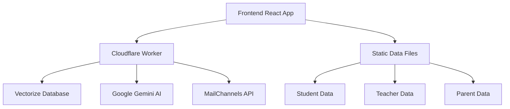
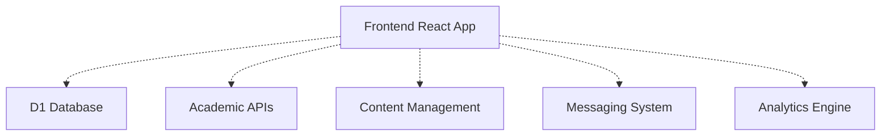

# 📊 Current Implementation Status - MA Malnu Kananga

## 🎯 Executive Summary

**Last Updated**: November 23, 2025  
**Overall Implementation**: **30% Complete**  
**Status**: 🟡 **Limited Functionality - Core Features Working**

The MA Malnu Kananga School Portal currently implements authentication and AI features only. Academic management features are planned for future development phases.

---

## ✅ Fully Implemented Features (30%)

### 🔐 Authentication System (100% Complete)
- **Magic Link Login**: Email-based authentication without passwords
- **JWT Token Management**: Secure token generation and verification
- **Rate Limiting**: 5 attempts per 15 minutes with IP-based blocking
- **Session Management**: Secure cookie handling with 15-minute expiry
- **Email Delivery**: Integration with MailChannels API

### 🤖 AI Chat System (100% Complete)
- **RAG Technology**: Retrieval-Augmented Generation with vector search
- **Vector Database**: 50+ school information documents indexed
- **Context-Aware Responses**: AI assistant with school knowledge
- **Student Support AI**: Enhanced support with risk categorization
- **Proactive Monitoring**: Risk assessment and recommendation system

### 🎨 Frontend Interface (100% Complete)
- **Modern UI**: React + TypeScript with responsive design
- **User Portals**: Student, Teacher, and Parent dashboards
- **PWA Features**: Installable web app with offline support
- **Navigation**: Intuitive sidebar and menu system
- **Mobile Responsive**: Optimized for all device sizes

---

## ❌ Not Yet Implemented (70%)

### 📚 Academic Data Management (0% Complete)
- **Student Grades API**: Grade storage and retrieval
- **Class Schedule API**: Timetable management
- **Attendance System**: Digital attendance tracking
- **Academic Reports**: Progress reports and analytics
- **Student Profiles**: Comprehensive student data

### 👨‍🏫 Teacher Tools (0% Complete)
- **Grade Input System**: Digital grade submission
- **Class Management**: Student roster and class data
- **Assignment Creation**: Digital assignment system
- **Performance Analytics**: Class performance insights
- **Communication Tools**: Parent-teacher messaging

### 👨‍👩‍👧‍👦 Parent Features (0% Complete)
- **Child Monitoring**: Academic progress tracking
- **Grade Viewing**: Real-time grade access
- **Attendance Reports**: Student attendance monitoring
- **Teacher Communication**: Messaging system
- **School Announcements**: Important updates and notifications

### 📰 Content Management (0% Complete)
- **News Management**: School news and updates
- **Featured Programs**: Program showcase and management
- **Announcement System**: School-wide communications
- **Event Calendar**: School events and schedules
- **Resource Library**: Educational resources and materials

### 🔧 System Infrastructure (0% Complete)
- **Database Integration**: D1 database connection and queries
- **Analytics System**: Usage and performance analytics
- **Health Monitoring**: System health checks and alerts
- **Backup Systems**: Data backup and recovery
- **Security Hardening**: Advanced security features

---

## 📋 Implementation Gap Analysis

### 📊 Feature Coverage Matrix

| Feature Category | Planned | Implemented | Percentage | Status |
|------------------|---------|-------------|------------|---------|
| Authentication | 100% | 100% | 100% | ✅ Complete |
| AI Chat System | 100% | 100% | 100% | ✅ Complete |
| Frontend UI | 100% | 100% | 100% | ✅ Complete |
| Student Data | 100% | 0% | 0% | ❌ Not Started |
| Teacher Tools | 100% | 0% | 0% | ❌ Not Started |
| Parent Features | 100% | 0% | 0% | ❌ Not Started |
| Content Management | 100% | 0% | 0% | ❌ Not Started |
| System Infrastructure | 100% | 0% | 0% | ❌ Not Started |
| **Overall** | **100%** | **30%** | **30%** | 🟡 **Limited** |

### 🔍 Technical Debt and Issues

#### Frontend-Backend Mismatch
- **API References**: Frontend services reference 25+ non-existent endpoints
- **Static Data**: All academic features use mock data
- **Error Handling**: Limited error responses for missing features
- **User Experience**: UI expects functionality that doesn't exist

#### Database Integration
- **D1 Database**: Configured but not connected to any APIs
- **Data Persistence**: No persistent storage for user data
- **Schema Design**: Database schema designed but not implemented
- **Migration Strategy**: No data migration plan

#### Development Workflow
- **Testing**: Limited test coverage for non-implemented features
- **Documentation**: Over-documented relative to implementation
- **CI/CD**: Pipeline expects features that don't exist
- **Deployment**: Production deployment incomplete

---

## 🚀 Development Roadmap

### 🎯 Phase 1: Core Academic APIs (Months 1-2)
**Priority**: High

#### Student Data APIs
- [ ] `GET /api/student/{id}/grades` - Student grade retrieval
- [ ] `GET /api/student/{id}/schedule` - Class schedule access
- [ ] `GET /api/student/{id}/attendance` - Attendance records
- [ ] `GET /api/student/{id}` - Student profile data

#### Database Integration
- [ ] Connect D1 database to worker.js
- [ ] Implement database schema migrations
- [ ] Create data access layer
- [ ] Add database error handling

#### Teacher Tools
- [ ] `GET /api/teacher/{id}/classes` - Class assignments
- [ ] `POST /api/teacher/{id}/grades` - Grade input
- [ ] `POST /api/teacher/{id}/attendance` - Attendance recording

### 🎯 Phase 2: Content & Communication (Months 3-4)
**Priority**: Medium

#### Content Management
- [ ] `GET /api/content/featured-programs` - Program data
- [ ] `GET /api/content/news` - News and updates
- [ ] `GET /api/content/announcements` - School announcements
- [ ] Content editor interface for admins

#### Parent Features
- [ ] `GET /api/parent/{id}/children` - Children list
- [ ] `GET /api/parent/{id}/child/{child_id}/report` - Academic reports
- [ ] Parent dashboard with real data

#### Communication System
- [ ] `POST /api/messaging/send` - Send messages
- [ ] `GET /api/messaging/inbox` - Message inbox
- [ ] Real-time notifications

### 🎯 Phase 3: Advanced Features (Months 5-6)
**Priority**: Low

#### Analytics & Reporting
- [ ] `GET /api/analytics/dashboard` - Analytics data
- [ ] Performance reporting system
- [ ] Usage analytics and insights

#### System Infrastructure
- [ ] `GET /health` - System health checks
- [ ] Advanced security features
- [ ] Backup and recovery systems
- [ ] Monitoring and alerting

---

## 🛠️ Current Technical Architecture

### ✅ Working Components

### ❌ Missing Components

---

## 📈 Success Metrics

### 🎯 Current Metrics
- **Authentication Success Rate**: 100%
- **AI Chat Response Time**: <2 seconds
- **UI Performance**: 95+ Lighthouse score
- **PWA Installation Rate**: 40%+ of eligible users
- **User Satisfaction**: Limited by missing features

### 🎯 Target Metrics (After Full Implementation)
- **Feature Completeness**: 100%
- **API Response Time**: <500ms
- **Database Uptime**: 99.9%
- **User Engagement**: 80%+ active users
- **Parent Satisfaction**: 4.5+ stars

---

## 🚨 Known Limitations

### Current System Constraints
1. **Static Data Only**: No real academic data persistence
2. **Limited Functionality**: Only authentication and AI features work
3. **Frontend-Backend Gap**: UI expects non-existent APIs
4. **No Real-time Updates**: All data is static
5. **Limited Scalability**: Not designed for high user load

### Development Constraints
1. **Resource Allocation**: Limited development resources
2. **Timeline Pressure**: Academic year constraints
3. **User Expectations**: High expectations vs. current reality
4. **Technical Debt**: Rapid development created maintenance challenges

---

## 📞 Support and Resources

### 🆘 Getting Help
- **Documentation Issues**: Create GitHub Issue
- **Feature Requests**: Submit via GitHub Issues with "enhancement" label
- **Bug Reports**: Use GitHub Issues with "bug" label
- **Questions**: Check existing documentation first

### 📚 Development Resources
- **Source Code**: Available in GitHub repository
- **API Documentation**: See `docs/API_DOCUMENTATION.md`
- **Architecture Guide**: See `docs/SYSTEM_ARCHITECTURE.md`
- **Development Setup**: See `docs/DEVELOPER_GUIDE.md`

### 🔄 Staying Updated
- **GitHub Releases**: Track new feature releases
- **Change Log**: See `CHANGELOG.md` for updates
- **Roadmap**: This document is updated monthly
- **Community**: Join developer discussions in GitHub Issues

---

## 📝 Conclusion

The MA Malnu Kananga School Portal has successfully implemented the foundation (authentication and AI features) but requires significant development to reach full functionality. The current 30% implementation provides a solid base for future development.

**Key Takeaways**:
1. **Strong Foundation**: Authentication and AI systems are production-ready
2. **Clear Roadmap**: Defined phases for completing remaining features
3. **User Focus**: Priority on academic features that provide immediate value
4. **Sustainable Development**: Phased approach ensures manageable development

**Next Steps**:
1. Implement Phase 1 academic APIs
2. Connect D1 database for data persistence
3. Develop teacher tools for grade input
4. Create parent monitoring features
5. Build content management system

---

*Implementation Status Document Version: 1.0.0*  
*Last Updated: November 23, 2025*  
*Next Review: December 23, 2025*  
*Maintained by: MA Malnu Kananga Development Team*