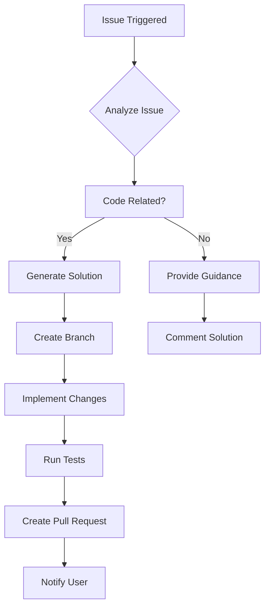
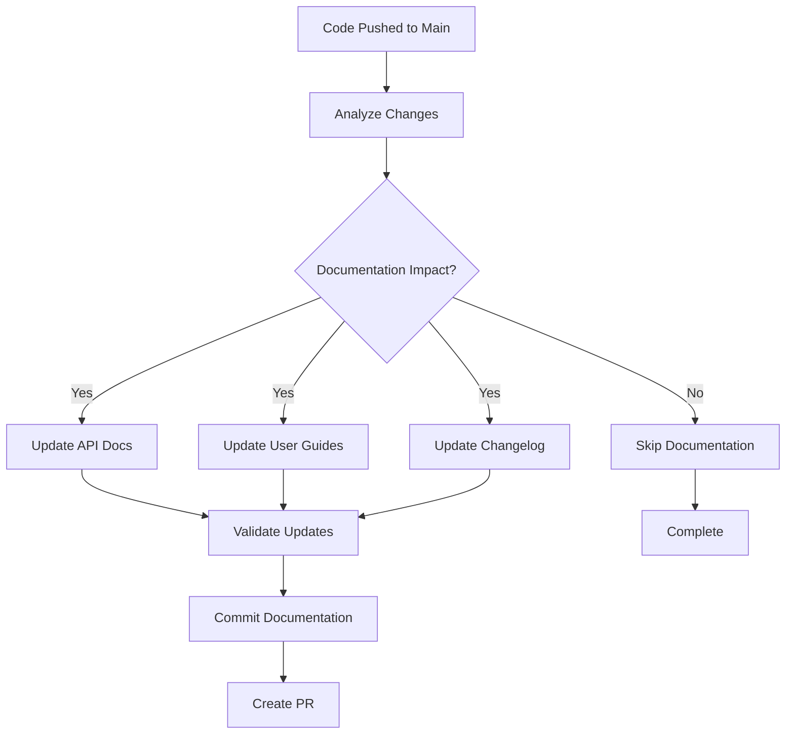
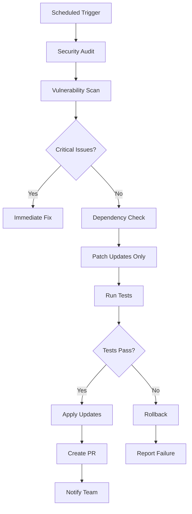
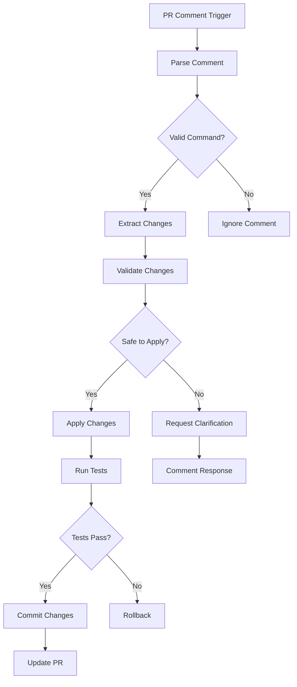
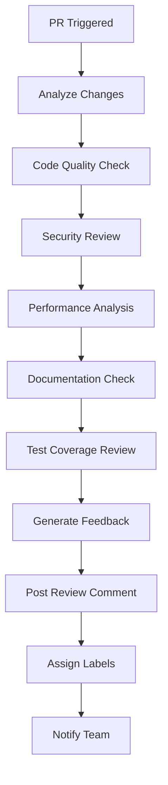

# 🔧 GitHub Actions Workflows Guide - MA Malnu Kananga

## 🌟 Overview

MA Malnu Kananga repository dilengkapi dengan 5 workflow GitHub Actions otomatis yang menyediakan automation lengkap untuk development, maintenance, dan code review. Workflow ini dirancang untuk meningkatkan produktivitas dan menjaga kualitas kode secara konsisten.

---

**GitHub Actions Guide Version: 1.0.0**  
**Last Updated: November 24, 2024**  
**Implementation Status: All Workflows Operational**

## 📋 Table of Contents

1. [Workflow Overview](#workflow-overview)
2. [iFlow - Solve Issue](#iflow---solve-issue)
3. [iFlow - Update Documentation](#iflow---update-documentation)
4. [iFlow - Repository Maintenance](#iflow---repository-maintenance)
5. [iFlow - Apply PR Changes](#iflow---apply-pr-changes)
6. [iFlow - Review Pull Request](#iflow---review-pull-request)
7. [Workflow Configuration](#workflow-configuration)
8. [Troubleshooting](#troubleshooting)
9. [Best Practices](#best-practices)

---

## 🔍 Workflow Overview

### Available Workflows

| Workflow | Trigger | Purpose | Status |
|----------|---------|---------|--------|
| **iFlow - Solve Issue** | Issue opened/reopened/commented | Automatic issue resolution | ✅ Active |
| **iFlow - Update Documentation** | Push to main branch | Documentation auto-update | ✅ Active |
| **iFlow - Repository Maintenance** | Scheduled (Mon-Fri 02:00 UTC) | Security audit & dependency updates | ✅ Active |
| **iFlow - Apply PR Changes** | PR comment with trigger | Apply review feedback automatically | ✅ Active |
| **iFlow - Review Pull Request** | PR opened/reopened/synchronized | Automated code review | ✅ Active |

### Architecture Diagram

```
┌─────────────────┐    ┌──────────────────┐    ┌─────────────────┐
│   GitHub Repo   │───▶│  GitHub Actions  │───▶│  Automation     │
│   Events        │    │   Workflows      │    │  Results        │
└─────────────────┘    └──────────────────┘    └─────────────────┘
         │                       │                       │
         ▼                       ▼                       ▼
┌─────────────────┐    ┌──────────────────┐    ┌─────────────────┐
│ Issues/PRs      │    │ Scheduled Jobs   │    │ Code Changes    │
│ Comments        │    │ Push Events      │    │ Reviews         │
└─────────────────┘    └──────────────────┘    └─────────────────┘
```

---

## 🤖 iFlow - Solve Issue

### File: `.github/workflows/iflow-issue.yml`

### Purpose
Workflow ini secara otomatis menangani issue yang dibuka di repository. Dapat memahami permintaan, mengimplementasikan solusi, dan membuat pull request.

### Triggers
- **Issue Opened**: Otomatis berjalan ketika issue baru dibuka
- **Issue Reopened**: Berjalan ketika issue dibuka kembali
- **Issue Commented**: Dijalankan dengan komentar `@iflow-cli /solve`

### Workflow Process



### Capabilities

**✅ Automatic Code Implementation:**
- Bug fixes
- Feature additions
- Code refactoring
- Documentation updates

**✅ Issue Analysis:**
- Natural language processing
- Code context understanding
- Solution generation
- Impact assessment

**✅ Pull Request Creation:**
- Automatic branch creation
- Commit message generation
- PR description
- Label assignment

### Usage Examples

**Example 1: Bug Report**
```
Issue Title: Login button not working on mobile
Issue Body: The login button is unresponsive on mobile devices
```

**Expected Action:**
- Analyze the login component
- Identify responsive design issues
- Fix CSS/JavaScript issues
- Create PR with mobile fixes

**Example 2: Feature Request**
```
Issue Title: Add dark mode toggle
Issue Body: Please add a dark mode toggle to the header
```

**Expected Action:**
- Implement dark mode CSS variables
- Add toggle component
- Update theme context
- Create PR with dark mode feature

### Manual Trigger

Untuk menjalankan workflow secara manual:

1. Buka issue yang ingin diselesaikan
2. Comment dengan: `@iflow-cli /solve`
3. Workflow akan berjalan dalam beberapa menit
4. Hasil akan di-comment di issue yang sama

---

## 📚 iFlow - Update Documentation

### File: `.github/workflows/iflow-docs.yml`

### Purpose
Secara otomatis memperbarui dokumentasi ketika ada perubahan di branch `main`. Menganalisis perubahan kode dan memperbarui file dokumentasi yang relevan.

### Triggers
- **Push to main**: Otomatis berjalan setiap ada push ke branch main
- **Manual dispatch**: Dapat dijalankan secara manual dari GitHub Actions tab

### Documentation Update Process



### Documentation Types Updated

**✅ API Documentation:**
- New endpoints documentation
- Parameter updates
- Response schema changes
- Deprecation notices

**✅ User Guides:**
- Feature updates
- Screenshot updates
- Workflow changes
- New feature explanations

**✅ Technical Documentation:**
- Architecture changes
- Setup instructions
- Configuration updates
- Troubleshooting guides

**✅ Changelog:**
- Version updates
- Feature additions
- Bug fixes
- Breaking changes

### Update Frequency

**Automatic Updates:**
- Real-time untuk API changes
- Daily untuk comprehensive documentation
- Weekly untuk user guide reviews

**Manual Updates:**
- Triggered by major releases
- Requested by documentation team
- Scheduled reviews

---

## 🔧 iFlow - Repository Maintenance

### File: `.github/workflows/iflow-maintenance.yml`

### Purpose
Menjalankan audit keamanan dan memperbarui dependensi secara berkala. Hanya menerapkan pembaruan patch-level untuk menghindari perubahan yang merusak.

### Triggers
- **Scheduled**: Setiap hari Senin-Jumat pukul 02:00 UTC
- **Manual dispatch**: Dapat dijalankan secara manual
- **Workflow dispatch**: Dapat dipicu dari workflow lain

### Maintenance Process



### Maintenance Tasks

**✅ Security Audits:**
- Vulnerability scanning
- Dependency security checks
- Code security analysis
- Configuration security review

**✅ Dependency Updates:**
- Patch-level updates only
- Security patches priority
- Compatibility checks
- Automated testing

**✅ Code Quality:**
- Linting fixes
- Type checking
- Code formatting
- Performance optimization

**✅ Repository Health:**
- Large file detection
- Unused dependency removal
- License compliance
- Documentation consistency

### Update Policy

**Safe Updates (Auto-applied):**
- Patch versions (x.x.1 → x.x.2)
- Security patches
- Typo fixes
- Documentation updates

**Manual Review Required:**
- Minor versions (x.1.x → x.2.x)
- Major versions (1.x.x → 2.x.x)
- Breaking changes
- API modifications

---

## 🔄 iFlow - Apply PR Changes

### File: `.github/workflows/iflow-pr.yml`

### Purpose
Menerapkan umpan balik kode dari komentar review pull request. Dapat menerapkan perubahan kecil seperti perbaikan typo atau penyesuaian parameter.

### Triggers
- **PR Comment**: Komentar mengandung `@iflow-cli /apply`
- **Collaborator Comment**: Comment dari kolaborator repository
- **Manual dispatch**: Dijalankan secara manual

### Change Application Process



### Supported Change Types

**✅ Safe Changes (Auto-applied):**
- Typo fixes
- Formatting corrections
- Variable name changes
- Comment updates
- Import statement fixes

**✅ Parameter Adjustments:**
- Function parameter defaults
- Configuration values
- Timeout adjustments
- Environment variable references

**✅ Documentation Updates:**
- README corrections
- Comment improvements
- API documentation fixes
- Code example updates

### Usage Examples

**Example 1: Typo Fix**
```bash
@iflow-cli /apply
Fix typo in variable name: "usserData" → "userData"
```

**Example 2: Formatting Fix**
```bash
@iflow-cli /apply
Fix indentation in authService.ts line 45-50
```

**Example 3: Parameter Update**
```bash
@iflow-cli /apply
Update API timeout from 5000 to 10000ms
```

### Safety Measures

**✅ Change Validation:**
- Syntax checking
- Type validation
- Security scanning
- Impact assessment

**✅ Rollback Capability:**
- Automatic rollback on test failure
- Change history tracking
- Revert functionality
- Notification system

---

## 👀 iFlow - Review Pull Request

### File: `.github/workflows/iflow-reviewpr.yml`

### Purpose
Secara otomatis melakukan code review terhadap pull request yang dibuka. Memberikan umpan balik konstruktif tentang koreksi, keamanan, dan kualitas kode.

### Triggers
- **Pull Request Opened**: Otomatis review PR baru
- **Pull Request Reopened**: Review PR yang dibuka kembali
- **Pull Request Synchronized**: Review PR dengan perubahan baru
- **Manual dispatch**: Review on-demand

### Review Process



### Review Categories

**✅ Code Quality:**
- Code style consistency
- Best practices adherence
- Error handling
- Code organization
- Performance considerations

**✅ Security Review:**
- Input validation
- Authentication checks
- Data exposure risks
- Dependency vulnerabilities
- Configuration security

**✅ Architecture Review:**
- Design patterns
- Code modularity
- Scalability considerations
- Integration points
- Technical debt

**✅ Documentation Review:**
- Code comments
- API documentation
- README updates
- Example code
- Change documentation

### Review Feedback Types

**🔴 Critical Issues:**
- Security vulnerabilities
- Breaking changes
- Performance regressions
- Test failures

**🟡 Suggestions:**
- Code improvements
- Best practice recommendations
- Documentation additions
- Performance optimizations

**🟢 Positive Feedback:**
- Good implementation
- Clean code
- Comprehensive tests
- Excellent documentation

### Review Output Example

```markdown
## 🤖 Automated Code Review

### ✅ Strengths
- Clean code structure
- Comprehensive test coverage
- Good error handling

### 🔍 Suggestions for Improvement
- Consider adding input validation on line 45
- Documentation could be expanded for the new API endpoint
- Performance could be improved by caching the database query

### 🔒 Security Notes
- No security vulnerabilities detected
- Authentication properly implemented
- Data validation looks good

### 📊 Metrics
- Code coverage: 95%
- Complexity: Low
- Performance: Good
```

---

## ⚙️ Workflow Configuration

### Required Secrets

**GitHub Token:**
```yaml
env:
  GITHUB_TOKEN: ${{ secrets.GITHUB_TOKEN }}
```

**Optional Secrets:**
```yaml
env:
  # For external integrations
  SLACK_WEBHOOK: ${{ secrets.SLACK_WEBHOOK }}
  DISCORD_WEBHOOK: ${{ secrets.DISCORD_WEBHOOK }}
  
  # For advanced features
  OPENAI_API_KEY: ${{ secrets.OPENAI_API_KEY }}
  CLAUDE_API_KEY: ${{ secrets.CLAUDE_API_KEY }}
```

### Permissions Configuration

```yaml
permissions:
  contents: write          # Read/write repository contents
  pull-requests: write     # Create and update PRs
  issues: write           # Create and update issues
  checks: write           # Create check runs
  actions: read           # Read workflow runs
  deployments: write      # Create deployments
```

### Environment Variables

```yaml
env:
  # Workflow configuration
  WORKFLOW_TIMEOUT: 30    # Minutes
  MAX_RETRIES: 3          # Retry attempts
  
  # Code review settings
  REVIEW_DEPTH: full      # shallow, full
  CRITICAL_THRESHOLD: 8   # 1-10 scale
  
  # Documentation settings
  DOCS_AUTO_UPDATE: true  # Enable/disable
  CHANGELOG_AUTO_UPDATE: true
  
  # Maintenance settings
  AUTO_PATCH_UPDATE: true # Auto-apply patches
  SECURITY_SCAN: true     # Enable security scanning
```

---

## 🚨 Troubleshooting

### Common Issues

**❌ Workflow Fails to Start**
```yaml
# Check permissions
permissions:
  contents: write
  pull-requests: write
```

**❌ Secret Not Available**
```bash
# Verify secret exists
gh secret list

# Add missing secret
gh secret set GITHUB_TOKEN --body "your-token"
```

**❌ Rate Limiting**
```yaml
# Add delay between API calls
- name: Wait for rate limit
  run: sleep 30
```

**❌ Action Version Conflicts**
```yaml
# Use specific versions
uses: actions/checkout@v4
uses: actions/setup-node@v4
```

### Debugging Workflow

**Enable Debug Logging:**
```yaml
env:
  ACTIONS_STEP_DEBUG: true
  ACTIONS_RUNNER_DEBUG: true
```

**Check Workflow Logs:**
1. Go to Actions tab in GitHub
2. Select workflow run
3. Review each step's output
4. Check error messages and warnings

**Common Debug Commands:**
```bash
# Check runner environment
node --version
npm --version
git --version

# Verify repository state
git status
git log --oneline -5

# Check file permissions
ls -la
```

### Performance Issues

**Workflow Timeout:**
```yaml
jobs:
  build:
    timeout-minutes: 30
```

**Resource Optimization:**
```yaml
- name: Cache dependencies
  uses: actions/cache@v3
  with:
    path: ~/.npm
    key: ${{ runner.os }}-node-${{ hashFiles('**/package-lock.json') }}
```

---

## 📋 Best Practices

### Workflow Design

**✅ Modular Design:**
- Single responsibility per workflow
- Reusable action steps
- Clear separation of concerns
- Consistent naming conventions

**✅ Error Handling:**
- Comprehensive error catching
- Meaningful error messages
- Graceful failure handling
- Retry mechanisms for transient failures

**✅ Security:**
- Principle of least privilege
- Secret management best practices
- Input validation
- Audit logging

### Performance Optimization

**✅ Caching Strategy:**
```yaml
- name: Cache node modules
  uses: actions/cache@v3
  with:
    path: ~/.npm
    key: ${{ runner.os }}-node-${{ hashFiles('**/package-lock.json') }}
    restore-keys: |
      ${{ runner.os }}-node-
```

**✅ Parallel Execution:**
```yaml
jobs:
  test:
    strategy:
      matrix:
        node-version: [18, 20]
        os: [ubuntu-latest, windows-latest]
```

**✅ Conditional Execution:**
```yaml
- name: Deploy
  if: github.ref == 'refs/heads/main'
  run: echo "Deploying to production"
```

### Maintenance

**✅ Regular Updates:**
- Keep actions up to date
- Review workflow performance
- Update dependencies
- Monitor security advisories

**✅ Monitoring:**
- Workflow success rate tracking
- Performance metrics
- Error pattern analysis
- Resource usage monitoring

**✅ Documentation:**
- Inline comments for complex logic
- README updates for workflow changes
- Troubleshooting guides
- Usage examples

---

## 📞 Support & Resources

### Documentation
- [GitHub Actions Documentation](https://docs.github.com/en/actions)
- [Workflow Syntax Guide](https://docs.github.com/en/actions/using-workflows/workflow-syntax-for-github-actions)
- [Security Hardening Guide](https://docs.github.com/en/actions/security-guides/security-hardening-for-github-actions)

### Community Support
- GitHub Community Forums
- Stack Overflow tags: `github-actions`
- GitHub Discussions in repository

### Troubleshooting Resources
- [GitHub Actions Troubleshooting](https://docs.github.com/en/actions/using-workflows/troubleshooting-workflows)
- [Common Workflow Issues](https://docs.github.com/en/actions/using-workflows/about-workflows)
- Repository Issues: Create new issue for workflow problems

---

## 🎉 Conclusion

GitHub Actions workflows di MA Malnu Kananga menyediakan automation lengkap untuk meningkatkan produktivitas dan menjaga kualitas kode. Dengan 5 workflow yang saling melengkapi, repository ini dapat mengelola issue, dokumentasi, maintenance, dan code review secara otomatis.

**Key Benefits:**
- ✅ Reduced manual workload
- ✅ Improved code quality
- ✅ Faster issue resolution
- ✅ Consistent documentation
- ✅ Proactive maintenance

**Next Steps:**
1. Monitor workflow performance
2. Customize workflows for specific needs
3. Add additional automation as required
4. Train team on workflow usage

---

*GitHub Actions Workflows Guide Version: 1.0.0*  
*Last Updated: November 24, 2024*  
*Maintained by: MA Malnu Kananga DevOps Team*  
*Review Schedule: Monthly*