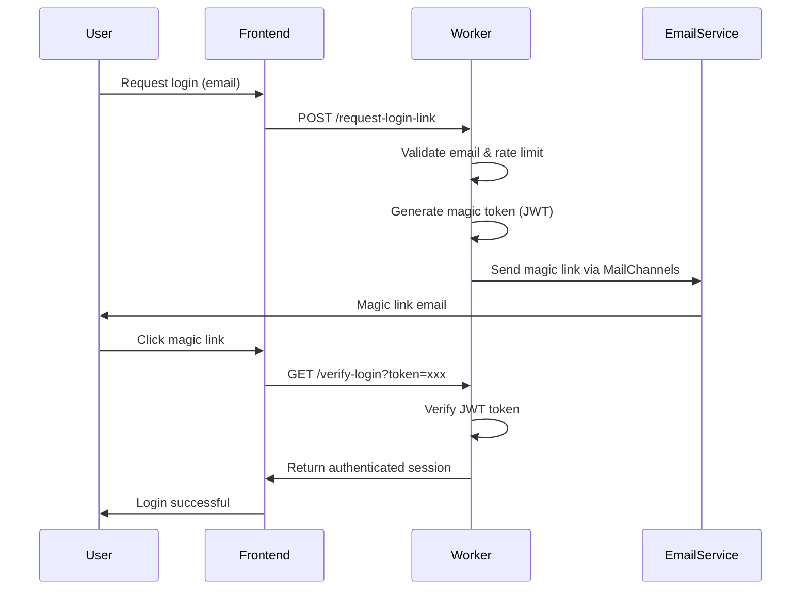

# 🔐 Security Implementation Guide - MA Malnu Kananga

## 🌟 Overview

Dokumentasi ini menjelaskan implementasi keamanan sistem MA Malnu Kananga secara mendetail, mencakup arsitektur keamanan, implementasi CSRF protection, authentication patterns, dan praktik terbaik keamanan yang diterapkan dalam production.

---

**Security Implementation Guide Version: 1.3.1**  
**Last Updated: November 24, 2024**  
**Security Status: Production Hardened**

---

## 🏗️ Security Architecture Implementation

### Multi-Layer Security Model

#### Layer 1: Network Security (Cloudflare)
- **DDoS Protection**: Automatic mitigation dengan Cloudflare's global network
- **Web Application Firewall (WAF)**: Rule-based protection terhadap common vulnerabilities
- **CDN Security**: Edge caching dengan security features
- **SSL/TLS Encryption**: End-to-end encryption untuk semua komunikasi

#### Layer 2: Application Security (Worker)
- **Security Middleware**: Comprehensive security validation di `security-middleware.js`
- **Authentication System**: Magic link dengan JWT token signing
- **CSRF Protection**: Double-submit cookie pattern
- **Rate Limiting**: Multi-tier rate limiting dengan progressive blocking
- **Input Validation**: Comprehensive XSS dan SQL injection prevention

#### Layer 3: Data Security
- **Encryption at Rest**: Cloudflare D1 database encryption
- **Encryption in Transit**: HTTPS/TLS untuk semua API calls
- **API Key Security**: Secure storage dengan environment variables
- **Data Minimization**: Collect only necessary data

---

## 🔑 Authentication Implementation

### Magic Link Authentication Flow



### JWT Token Implementation

#### Token Structure
```javascript
{
  "sub": "user@example.com",
  "iat": 1700123456,
  "exp": 1700124356,
  "iss": "malnu-api",
  "aud": "malnu-frontend",
  "role": "student|teacher|parent|admin",
  "session_id": "uuid-v4"
}
```

#### Security Features
- **HMAC-SHA256 Signing**: Secure token signature dengan SECRET_KEY
- **Short Expiry**: 15 minutes untuk magic links
- **One-Time Use**: Token invalid setelah digunakan
- **Secure Storage**: Token disimpan di memory, tidak persistent

#### Implementation Code
```javascript
// Token generation in worker.js
async generateMagicToken(email) {
  const header = { alg: 'HS256', typ: 'JWT' };
  const payload = {
    sub: email,
    iat: Math.floor(Date.now() / 1000),
    exp: Math.floor(Date.now() / 1000) + (15 * 60), // 15 minutes
    iss: 'malnu-api',
    aud: 'malnu-frontend',
    session_id: crypto.randomUUID()
  };
  
  return await this.signJWT(header, payload);
}
```

---

## 🛡️ CSRF Protection Implementation

### Double-Submit Cookie Pattern

#### Implementation Flow
1. **Initial Request**: Server generates CSRF token
2. **Cookie Storage**: Token disimpan di HttpOnly cookie
3. **Header Validation**: Client mengirim token di custom header
4. **Server Verification**: Server membandingkan cookie vs header

#### Code Implementation
```javascript
// CSRF token generation
generateCSRFToken() {
  const token = crypto.randomUUID();
  const signature = await this.signToken(token);
  return { token, signature };
}

// CSRF validation
validateCSRF(request) {
  const cookieToken = this.getCookie(request, 'csrf_token');
  const headerToken = request.headers.get('X-CSRF-Token');
  
  return cookieToken && headerToken && cookieToken === headerToken;
}
```

#### Security Headers
```javascript
const csrfHeaders = {
  'Set-Cookie': `csrf_token=${token}; HttpOnly; Secure; SameSite=Strict; Path=/; Max-Age=3600`,
  'X-CSRF-Token': token
};
```

---

## 🚦 Rate Limiting Implementation

### Multi-Tier Rate Limiting

#### Rate Limiting Tiers
```javascript
const rateLimits = {
  'auth': { maxRequests: 5, windowMs: 15 * 60 * 1000 }, // 5 per 15 min
  'chat': { maxRequests: 100, windowMs: 60 * 1000 },     // 100 per min
  'api': { maxRequests: 1000, windowMs: 60 * 1000 },     // 1000 per min
  'default': { maxRequests: 100, windowMs: 60 * 1000 }   // 100 per min
};
```

#### Progressive Blocking
```javascript
// Progressive rate limiting in security-middleware.js
isRateLimitExceeded(clientId, maxRequests = 100, windowMs = 60000, endpoint = 'default') {
  // ... existing logic ...
  
  // Progressive blocking for abusive clients
  if (clientData.count > maxRequests * 2) {
    console.warn(`SECURITY: Hard block for abusive client: ${clientId}`);
    return true; // Hard block
  }
  
  return clientData.count > maxRequests;
}
```

#### Client Fingerprinting
```javascript
getClientId(request) {
  const ip = request.headers.get('CF-Connecting-IP') || 'unknown';
  const userAgent = request.headers.get('User-Agent') || '';
  const fingerprint = this.createFingerprint(ip, userAgent);
  
  return {
    ip: ip,
    fingerprint: fingerprint,
    country: request.cf?.country || 'unknown',
    colo: request.cf?.colo || 'unknown'
  };
}
```

---

## 🔍 Input Validation & Sanitization

### Comprehensive XSS Prevention

#### Dangerous Patterns Detection
```javascript
const dangerousPatterns = [
  // Script injection patterns
  /<script\b[^<]*(?:(?!<\/script>)<[^<]*)*<\/script>/gi,
  /javascript:/gi,
  /vbscript:/gi,
  /data:text\/html/gi,
  
  // Event handler patterns
  /on\w+\s*=/gi,
  /onclick\s*=/gi,
  /onload\s*=/gi,
  
  // HTML injection patterns
  /<iframe\b[^>]*>/gi,
  /<object\b[^>]*>/gi,
  /<embed\b[^>]*>/gi,
  
  // CSS injection patterns
  /expression\s*\(/gi,
  /@import/gi,
  
  // Protocol injection
  /file:\/\//gi,
  /ftp:\/\//gi,
  
  // Encoding attacks
  /%3cscript/gi,
  /&#x3c;script/gi
];
```

#### Input Validation by Type
```javascript
validateInput(data, type = 'string') {
  switch (type) {
    case 'email':
      const emailRegex = /^[^\s@]+@[^\s@]+\.[^\s@]+$/;
      return emailRegex.test(data) && data.length <= 254;
      
    case 'message':
      return typeof data === 'string' && 
             data.length >= 1 && 
             data.length <= 5000 &&
             !/<script|javascript:|on\w+\s*=/i.test(data);
             
    case 'id':
      return /^[a-zA-Z0-9\-_]{1,50}$/.test(data);
      
    default:
      return typeof data === 'string' && 
             data.length <= 10000 &&
             !dangerousPatterns.some(pattern => pattern.test(data));
  }
}
```

### SQL Injection Prevention
```javascript
sanitizeSqlInput(input) {
  if (typeof input !== 'string') return input;
  
  return input
    .replace(/['"\\;]/g, '') // Remove quotes and semicolons
    .replace(/\b(SELECT|INSERT|UPDATE|DELETE|DROP|CREATE|ALTER|EXEC|UNION|SCRIPT)\b/gi, '')
    .replace(/--/g, '') // Remove SQL comments
    .replace(/\/\*[\s\S]*?\*\//g, '') // Remove SQL block comments
    .trim();
}
```

---

## 🔒 Security Headers Implementation

### Comprehensive CSP Policy
```javascript
const securityHeaders = {
  'X-Content-Type-Options': 'nosniff',
  'X-Frame-Options': 'DENY',
  'X-XSS-Protection': '1; mode=block',
  'Referrer-Policy': 'strict-origin-when-cross-origin',
  'Permissions-Policy': 'camera=(), microphone=(), geolocation=(), payment=(), usb=()',
  'Strict-Transport-Security': 'max-age=31536000; includeSubDomains; preload',
  
  // Comprehensive Content Security Policy
  'Content-Security-Policy': [
    "default-src 'self';",
    "script-src 'self' 'unsafe-inline' 'unsafe-eval';", // Required for React
    "style-src 'self' 'unsafe-inline' https://fonts.googleapis.com;",
    "img-src 'self' data: https: https://images.unsplash.com;",
    "font-src 'self' https://fonts.gstatic.com;",
    "connect-src 'self' https: wss:;",
    "frame-src 'none';",
    "frame-ancestors 'none';",
    "form-action 'self';",
    "base-uri 'self';",
    "manifest-src 'self';",
    "worker-src 'self' blob:;",
    "object-src 'none';",
    "media-src 'self';",
    "prefetch-src 'self';"
  ].join(' '),
  
  'Cross-Origin-Embedder-Policy': 'require-corp',
  'Cross-Origin-Resource-Policy': 'same-origin',
  'Cross-Origin-Opener-Policy': 'same-origin'
};
```

---

## 🌍 Geographic & IP Security

### Geographic Filtering
```javascript
isAllowedCountry(request) {
  const cf = request.cf;
  const allowedCountries = this.env.ALLOWED_COUNTRIES?.split(',') || ['ID'];
  return allowedCountries.includes(cf?.country);
}
```

### IP Blocking
```javascript
isBlockedIP(clientId) {
  const blockedIPs = this.env.BLOCKED_IPS?.split(',') || [];
  return blockedIPs.includes(clientId);
}
```

### Bot Detection
```javascript
isSuspiciousUserAgent(userAgent) {
  const suspiciousPatterns = [
    /bot/i, /crawler/i, /scraper/i, /spider/i,
    /curl/i, /wget/i, /python/i, /java/i, /go-http/i
  ];
  
  return suspiciousPatterns.some(pattern => pattern.test(userAgent));
}
```

---

## 🔐 Environment Security

### Required Environment Variables
```bash
# Security Configuration
SECRET_KEY=your_32_character_random_string_here
NODE_ENV=production

# Geographic Security (Optional)
ALLOWED_COUNTRIES=ID,SG,MY
BLOCKED_IPS=192.168.1.100,10.0.0.50

# API Security
API_KEY=your_gemini_api_key
CORS_ORIGIN=https://your-domain.com
```

### Security Validation
```javascript
validateEnvironment() {
  const required = ['SECRET_KEY', 'API_KEY'];
  const missing = required.filter(key => !this.env[key]);
  
  if (missing.length > 0) {
    throw new Error(`Missing required environment variables: ${missing.join(', ')}`);
  }
  
  if (this.env.SECRET_KEY.length < 32) {
    throw new Error('SECRET_KEY must be at least 32 characters long');
  }
}
```

---

## 🚨 Security Monitoring & Logging

### Security Event Logging
```javascript
// Security events to monitor
const securityEvents = {
  'RATE_LIMIT_EXCEEDED': 'Client exceeded rate limit',
  'BLOCKED_IP': 'Blocked IP attempted access',
  'INVALID_COUNTRY': 'Access from disallowed country',
  'XSS_ATTEMPT': 'XSS injection attempt detected',
  'SQL_INJECTION_ATTEMPT': 'SQL injection attempt detected',
  'CSRF_VIOLATION': 'CSRF token validation failed',
  'SUSPICIOUS_USER_AGENT': 'Suspicious user agent detected'
};

// Logging implementation
logSecurityEvent(event, details) {
  console.warn(`SECURITY: ${event} - ${securityEvents[event]}`, {
    timestamp: new Date().toISOString(),
    ...details
  });
}
```

### Real-time Monitoring
```javascript
// Health check with security status
async getSecurityStatus() {
  return {
    timestamp: new Date().toISOString(),
    rateLimitStore: this.rateLimitStore.size,
    blockedIPs: this.env.BLOCKED_IPS?.split(',').length || 0,
    allowedCountries: this.env.ALLOWED_COUNTRIES?.split(',').length || 0,
    lastSecurityEvent: this.lastSecurityEvent,
    systemStatus: 'operational'
  };
}
```

---

## 🛠️ Security Testing

### Automated Security Tests
```javascript
// Test cases for security validation
const securityTests = [
  {
    name: 'XSS Prevention',
    test: () => validateInput('<script>alert("xss")</script>'),
    expected: false
  },
  {
    name: 'SQL Injection Prevention',
    test: () => sanitizeSqlInput("'; DROP TABLE users; --"),
    expected: " DROP TABLE users"
  },
  {
    name: 'Email Validation',
    test: () => validateInput('test@example.com', 'email'),
    expected: true
  },
  {
    name: 'Rate Limiting',
    test: () => isRateLimitExceeded('test-client', 1, 1000),
    expected: false
  }
];
```

### Security Checklist
- [ ] SECRET_KEY configured and >= 32 characters
- [ ] All inputs validated and sanitized
- [ ] CSRF protection implemented for state-changing requests
- [ ] Rate limiting configured for all endpoints
- [ ] Security headers implemented
- [ ] Geographic filtering configured (if needed)
- [ ] IP blocking list maintained
- [ ] Error messages don't leak sensitive information
- [ ] All security events logged
- [ ] Regular security audits performed

---

## 📋 Security Incident Response

### Incident Response Procedure
1. **Detection**: Automated monitoring alerts
2. **Assessment**: Evaluate severity and impact
3. **Containment**: Block malicious IPs/users
4. **Eradication**: Patch vulnerabilities
5. **Recovery**: Restore normal operations
6. **Lessons Learned**: Update security measures

### Emergency Contacts
- **Security Team**: security@ma-malnukananga.sch.id
- **System Administrator**: admin@ma-malnukananga.sch.id
- **Incident Response**: incident@ma-malnukananga.sch.id

---

## 🔮 Future Security Enhancements

### Planned Security Features
- [ ] **WebAuthn Integration**: Passwordless authentication
- [ ] **Advanced Bot Detection**: Machine learning-based bot detection
- [ ] **Rate Limiting Database**: Persistent rate limiting across deployments
- [ ] **Security Analytics**: Advanced threat detection and analysis
- [ ] **Zero Trust Architecture**: Implement zero trust security model
- [ ] **Compliance Monitoring**: Automated compliance checking

### Security Roadmap
- **Q1 2025**: WebAuthn implementation and security analytics
- **Q2 2025**: Advanced bot detection and ML-based threat detection
- **Q3 2025**: Zero trust architecture implementation
- **Q4 2025**: Full compliance monitoring and automated security testing

---

## 📚 Additional Security Resources

### Documentation References
- [Security Guide](./SECURITY_GUIDE.md) - Overview security policies
- [API Documentation](./API_DOCUMENTATION.md) - API security implementation
- [Troubleshooting Guide](./TROUBLESHOOTING_GUIDE.md) - Security issues and solutions

### External Security Resources
- [OWASP Top 10](https://owasp.org/www-project-top-ten/)
- [Cloudflare Security Best Practices](https://www.cloudflare.com/learning/security/)
- [JWT Security Best Practices](https://auth0.com/blog/json-web-token-best-practices/)

---

**Security Implementation Guide - MA Malnu Kananga**

*Comprehensive security implementation documentation for production systems*

---

*Implementation Guide Version: 1.3.1*  
*Last Updated: November 24, 2024*  
*Security Team: MA Malnu Kananga*