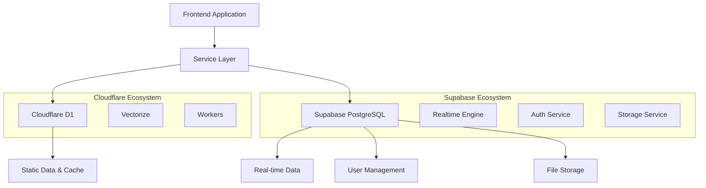

# 📚 System Architecture Documentation - MA Malnu Kananga

## 🌟 Overview

MA Malnu Kananga School Portal is built on a modern, serverless architecture designed for scalability, performance, and reliability. This document provides comprehensive technical details about the system architecture, components, and design decisions.

---

**System Architecture Version: 1.4.0**  
<<<<<<< HEAD
**Last Updated: November 24, 2024**  
=======

**Last Updated: 2025-11-24**  

**Last Updated: 2025-11-24

>>>>>>> origin/main
**Architecture Status: Production Ready with Enhanced Security**

## 🏗️ High-Level Architecture

### Architecture Diagram
```
┌─────────────────┐    ┌─────────────────┐    ┌─────────────────┐
│   Frontend      │    │   Cloudflare    │    │   External      │
│   (React +      │◄──►│   Workers       │◄──►│   Services      │
│   TypeScript)   │    │   (Backend)     │    │   (Google AI)   │
└─────────────────┘    └─────────────────┘    └─────────────────┘
         │                       │                       │
         │              ┌─────────────────┐              │
         │              │   Cloudflare    │              │
         └──────────────►│   D1 Database   │◄─────────────┘
                        │   (SQLite)      │
                        └─────────────────┘
                                 │
                        ┌─────────────────┐
                        │   Cloudflare    │
                        │   Vectorize     │
                        │   (Vector DB)   │
                        └─────────────────┘
```

### Core Principles
- **Serverless First**: All backend services run on Cloudflare Workers
- **Edge Computing**: Global distribution for low latency
- **JAMstack**: JavaScript, APIs, and Markup architecture
- **Progressive Enhancement**: Core functionality works without JavaScript
- **Mobile-First**: Responsive design with PWA capabilities

---

## 🎨 Frontend Architecture

<<<<<<< HEAD
### Enhanced Technology Stack with Security Integration
=======
### Technology Stack (Updated November 2024)
- **React 19.2**: Latest React with concurrent features, automatic batching, and Suspense
- **TypeScript 5.9**: Strict type safety with modern syntax and path mapping
- **Vite 7.2**: Ultra-fast build tool with HMR, optimized bundles, and plugin ecosystem
- **Tailwind CSS 4.1**: Latest utility-first CSS framework with PostCSS 8 and JIT compilation
- **Supabase 2.81**: Real-time database integration, authentication, and storage
- **React Query 5.90**: Advanced server state management, caching, and synchronization
- **PWA**: Progressive Web App with service worker, offline support, and install prompts
- **Sentry 10.25**: Error tracking and performance monitoring
>>>>>>> origin/main

#### Frontend Stack
- **React 19.2**: Modern React with concurrent features and security hooks
- **TypeScript 5.9**: Strict type safety with security type definitions
- **Vite 7.2**: Ultra-fast build tool with security plugin integration
- **Tailwind CSS 4.1**: Utility-first CSS framework with security-conscious design
- **React Query**: Server state management with secure caching strategies
- **PWA**: Progressive Web App with secure service worker implementation

#### Security Stack
- **Security Middleware**: Custom security-middleware.js with comprehensive protection
- **Web Crypto API**: Client-side encryption and secure token generation
- **CSRF Protection**: Token-based CSRF validation for all state changes
- **Input Sanitization**: Multi-layer input validation and XSS prevention
- **Rate Limiting**: Distributed rate limiting with progressive blocking
- **Security Logging**: Real-time security event monitoring and audit trails

#### Backend Stack
- **Cloudflare Workers**: Serverless backend with security-first architecture
- **Security-First Design**: All endpoints protected by security middleware
- **Distributed Rate Limiting**: KV-based rate limiting for multi-region deployment
- **Enhanced Authentication**: Magic link system with device fingerprinting
- **Secure Session Management**: HTTP-only, Secure, SameSite=Strict cookies
- **Comprehensive CORS**: Secure cross-origin resource sharing

#### AI & Data Stack
- **Google Gemini AI**: Primary AI model with secure API integration
- **Cloudflare Vectorize**: Vector database with secure access controls
- **Cloudflare D1**: SQL database with parameterized queries
- **RAG System**: Retrieval-Augmented Generation with security filtering
- **Embedding Models**: BGE Base EN v1.5 with secure processing
- **Knowledge Base**: Secure document management and vectorization

#### Monitoring & Observability Stack
- **SecurityLogger**: Custom security event logging with severity levels
- **Health Monitoring**: Comprehensive system health with security status
- **Performance Monitoring**: Security-aware performance metrics
- **Audit Trail**: KV-based security audit logs with 30-day retention
- **Real-time Alerting**: Multi-channel security alerting system
- **Compliance Tools**: Automated security compliance reporting

#### Development & DevOps Stack
- **ESLint Security**: Security-focused linting rules and configurations
- **Security Testing**: Automated security vulnerability scanning
- **Dependency Security**: Automated dependency vulnerability monitoring
- **Infrastructure as Code**: Secure Cloudflare Workers deployment
- **Secret Management**: Environment-based secure secret handling
- **CI/CD Security**: Security checks in deployment pipeline

### Component Architecture with Security Integration
```
src/
├── components/           # Reusable UI components
│   ├── common/          # Generic components (Button, Modal, etc.)
│   │   ├── ProtectedButton.tsx    # CSRF-protected actions
│   │   ├── SecureForm.tsx         # Input validation integration
│   │   └── SecurityAlert.tsx      # Security notification display
│   ├── forms/           # Form-specific components
│   │   ├── LoginForm.tsx          # Magic link authentication
│   │   ├── SecureInput.tsx        # Sanitized input fields
│   │   └── CSRFProtectedForm.tsx  # CSRF token integration
│   ├── layout/          # Layout and navigation components
│   │   ├── AuthenticatedRoute.tsx # Route protection
│   │   ├── SecurityHeader.tsx     # Security status display
│   │   └── RateLimitIndicator.tsx # Rate limiting feedback
│   ├── features/        # Feature-specific components
│   │   ├── AIChat/              # RAG-powered chat interface
│   │   │   ├── ChatInterface.tsx        # Secure chat UI
│   │   │   ├── MessageSanitizer.tsx     # Input sanitization
│   │   │   └── ResponseValidator.tsx    # Output validation
│   │   ├── StudentSupport/       # Enhanced support system
│   │   │   ├── SupportDashboard.tsx     # Risk assessment display
│   │   │   ├── ProactiveAlerts.tsx      # Automated interventions
│   │   │   └── ResourceRecommendation.tsx # AI-powered resources
│   │   └── Security/             # Security management
│   │       ├── SecurityMonitor.tsx      # Real-time security status
│   │       ├── ThreatDetection.tsx      # Suspicious activity alerts
│   │       └── AuditLog.tsx            # Security event viewer
├── pages/               # Route-level components
│   ├── StudentSupportPage.tsx    # Enhanced student support
│   ├── SecurityDashboard.tsx     # Security monitoring
│   └── AdminPanel.tsx            # Administrative security controls
├── hooks/               # Custom React hooks
│   ├── useSecurity.ts           # Security state management
│   ├── useCSRF.ts               # CSRF token handling
│   ├── useRateLimit.ts          # Rate limiting awareness
│   ├── useAIChat.ts             # Secure AI interactions
│   └── useAuthentication.ts     # Enhanced auth management
├── services/            # API service layer
│   ├── securityService.ts       # Security middleware integration
│   ├── authService.ts           # Enhanced authentication
│   ├── aiChatService.ts         # Secure AI API calls
│   ├── csrfService.ts           # CSRF token management
│   └── auditService.ts          # Security logging
├── utils/               # Utility functions
│   ├── securityUtils.ts         # Security helper functions
│   ├── inputValidation.ts       # Input sanitization
│   ├── encryption.ts            # Client-side encryption
│   └── rateLimitUtils.ts        # Rate limiting helpers
├── types/               # TypeScript type definitions
│   ├── security.ts              # Security-related types
│   ├── authentication.ts        # Auth interface definitions
│   ├── aiChat.ts                # AI system types
│   └── audit.ts                 # Logging and monitoring types
└── assets/              # Static assets
```

### State Management Strategy
- **Local State**: React useState for component state
- **Server State**: React Query for API data and caching
- **Global State**: React Context for authentication and theme
- **Form State**: React Hook Form for form management
- **URL State**: URL parameters for routing and filters

### Performance Optimizations
- **Code Splitting**: Lazy loading with React.lazy()
- **Tree Shaking**: Unused code elimination
- **Bundle Analysis**: Regular bundle size monitoring
- **Image Optimization**: WebP format with fallbacks
- **Caching Strategy**: Service worker for offline support

---

## ⚙️ Backend Architecture

### Cloudflare Workers
- **Runtime**: V8 isolates with sub-millisecond startup
- **Language**: JavaScript/ES2022 with TypeScript support
- **Memory**: 128MB per worker with CPU time limits
- **Global Distribution**: 200+ edge locations worldwide
- **Zero Cold Starts**: Instant response times

### Enhanced Worker Structure with Security Layers
```javascript
// worker.js - Main entry point with comprehensive security
export default {
  async fetch(request, env, ctx) {
    // Security middleware initialization
    const security = new SecurityMiddleware(env);
    const securityLogger = new SecurityLogger(env);
    
    // Security validation pipeline
    const securityCheck = await security.performSecurityCheck(request, endpoint);
    if (!securityCheck.allowed) {
      return securityErrorResponse(securityCheck.reason);
    }
    
    // Request routing and handling with security context
    // Rate limiting, CSRF validation, authentication checks
  },
  async scheduled(event, env, ctx) {
    // Security maintenance tasks
    // Log rotation, threat analysis, system health checks
  }
};

// Security Infrastructure/
├── security-middleware.js    # Comprehensive security middleware
│   ├── SecurityMiddleware class
│   ├── Rate limiting with progressive blocking
│   ├── Input validation and sanitization
│   ├── XSS/SQL injection prevention
│   ├── CSRF token management
│   ├── IP and geographic filtering
│   └── Bot detection and monitoring
├── security-logger.js        # Security event logging
│   ├── SecurityLogger class
│   ├── Severity-based categorization
│   ├── KV-based audit trail
│   ├── Real-time threat monitoring
│   └── Compliance reporting
└── distributed-rate-limit.js # Distributed rate limiting
    ├── DistributedRateLimitStore class
    ├── KV-based storage for multi-region
    ├── Progressive blocking algorithms
    └── Client fingerprinting

// Core Services/
├── authService.js           # Enhanced authentication
│   ├── Magic link generation
│   ├── JWT token management
│   ├── Session security
│   └── CSRF token handling
├── aiService.js             # AI system integration
│   ├── RAG pipeline management
│   ├── Vector database operations
│   ├── Context retrieval
│   └── Response filtering
├── vectorService.js         # Vector database operations
│   ├── Embedding generation
│   ├── Similarity search
│   ├── Knowledge base management
│   └── Seeding operations
├── databaseService.js       # D1 database operations
│   ├── Query optimization
│   ├── Transaction management
│   ├── Connection pooling
│   └── Data validation
├── messagingService.js      # Email and notifications
│   ├── MailChannels integration
│   ├── Template management
│   ├── Delivery tracking
│   └── Security notifications
└── monitoringService.js     # System health monitoring
    ├── Health check endpoints
    ├── Performance metrics
    ├── Security status tracking
    └── Automated alerting
```

### Database Architecture

#### Cloudflare D1 (SQLite)
- **Type**: Serverless SQL database
- **Compatibility**: SQLite 3.39+
- **Performance**: Sub-millisecond query response
- **Scalability**: Automatic scaling with usage
- **Replication**: Multi-region replication

#### Schema Design
```sql
-- Users table
CREATE TABLE users (
  id INTEGER PRIMARY KEY,
  email TEXT UNIQUE NOT NULL,
  name TEXT NOT NULL,
  role TEXT NOT NULL CHECK (role IN ('student', 'teacher', 'parent', 'admin')),
  created_at DATETIME DEFAULT CURRENT_TIMESTAMP,
  updated_at DATETIME DEFAULT CURRENT_TIMESTAMP
);

-- Academic records
CREATE TABLE grades (
  id INTEGER PRIMARY KEY,
  student_id INTEGER REFERENCES users(id),
  subject TEXT NOT NULL,
  semester TEXT NOT NULL,
  uts INTEGER CHECK (uts >= 0 AND uts <= 100),
  uas INTEGER CHECK (uas >= 0 AND uas <= 100),
  tugas INTEGER CHECK (tugas >= 0 AND tugas <= 100),
  created_at DATETIME DEFAULT CURRENT_TIMESTAMP
);

-- Attendance tracking
CREATE TABLE attendance (
  id INTEGER PRIMARY KEY,
  student_id INTEGER REFERENCES users(id),
  date DATE NOT NULL,
  status TEXT NOT NULL CHECK (status IN ('present', 'sick', 'permission', 'absent')),
  notes TEXT,
  created_at DATETIME DEFAULT CURRENT_TIMESTAMP
);
```

### Supabase Integration Architecture

#### Hybrid Database Approach
MA Malnu Kananga menggunakan **dual database architecture** untuk optimalisasi performa dan fitur:



#### Supabase PostgreSQL
- **Type**: Managed PostgreSQL database
- **Version**: PostgreSQL 15+
- **Features**: Real-time subscriptions, Row Level Security (RLS)
- **Integration**: REST API, GraphQL API, Realtime WebSocket
- **Use Cases**: User management, real-time collaboration, file storage

#### Supabase Service Integration
```typescript
// Service files in src/services/
├── supabase/
│   ├── supabaseClient.ts     # Supabase client configuration
│   ├── supabaseApiService.ts # API service layer
│   ├── supabaseAuthService.ts # Authentication service
│   └── supabaseStorage.ts    # File storage service
```

#### Data Distribution Strategy
| Data Type | Storage | Reason |
|-----------|---------|--------|
| **User Authentication** | Supabase | Advanced auth features, social login |
| **Real-time Chat** | Supabase | WebSocket support, real-time sync |
| **File Uploads** | Supabase Storage | CDN integration, image optimization |
| **Academic Records** | Cloudflare D1 | Fast read operations, edge caching |
| **Static Content** | Cloudflare D1 | Global distribution, low latency |
| **AI Vector Data** | Cloudflare Vectorize | Specialized vector operations |

#### Service Communication
```typescript
// Example: Hybrid service usage
class HybridDataService {
  // Use D1 for fast academic data
  async getStudentGrades(studentId: string) {
    return await this.d1Service.query(
      'SELECT * FROM grades WHERE student_id = ?', [studentId]
    );
  }
  
  // Use Supabase for real-time features
  async subscribeToChatUpdates(chatId: string) {
    return await this.supabaseClient
      .channel(`chat:${chatId}`)
      .on('postgres_changes', { event: 'INSERT', schema: 'public' }, payload => {
        this.handleNewMessage(payload.new);
      })
      .subscribe();
  }
}
```

### Vector Database Architecture

#### Cloudflare Vectorize
- **Dimensions**: 768 (compatible with Google Gemini embedding models)
- **Metric**: Cosine similarity for semantic search with 0.75 cutoff
- **Indexing**: HNSW (Hierarchical Navigable Small World) algorithm
- **Performance**: Millisecond vector similarity search across global edge
- **Storage**: Up to 1M vectors with automatic scaling

#### Supabase Integration (New)
- **Real-time Database**: PostgreSQL with real-time subscriptions
- **Authentication**: JWT-based auth with social providers
- **Storage**: File storage for documents and media
- **Edge Functions**: Serverless functions for complex operations
- **Row Level Security**: Fine-grained access control

#### Vector Schema
```javascript
// Document structure for vectorization
{
  id: "doc_123",
  text: "Program unggulan sains MA Malnu Kananga...",
  metadata: {
    category: "academic",
    language: "id",
    priority: "high",
    last_updated: "2025-11-24"
  },
  values: [0.1, 0.2, 0.3, ...] // 768-dimensional vector
}
```

---

## 🤖 AI System Architecture

### RAG (Retrieval-Augmented Generation)
```
User Query → Embedding → Vector Search → Context Retrieval → Prompt Engineering → AI Generation → Response
```

### Components
1. **Query Processing**: Natural language understanding
2. **Embedding Generation**: Text to vector conversion
3. **Similarity Search**: Find relevant context
4. **Context Assembly**: Build prompt with retrieved context
5. **AI Generation**: Generate response with Google Gemini
6. **Response Formatting**: Structure and present answer

### AI Integration
- **Provider**: Google Gemini AI (gemini-1.5-flash)
- **Model**: 1.5 Flash for fast responses
- **Language**: Indonesian optimization
- **Context Window**: 32K tokens
- **Rate Limits**: 60 requests per minute

### Knowledge Base
- **School Information**: Programs, facilities, policies
- **Academic Data**: Curriculum, schedules, requirements
- **FAQ Database**: Common questions and answers
- **Dynamic Content**: News, announcements, events

---

## 🔐 Security Architecture Implementation

### Security Middleware Integration
MA Malnu Kananga implements comprehensive security middleware (`security-middleware.js`) with multi-layered protection:

#### Core Security Components
```javascript
// SecurityMiddleware class provides:
- Enhanced rate limiting with progressive blocking
- Comprehensive input validation and sanitization
- SQL injection prevention
- XSS protection with advanced pattern detection
- CSRF token validation
- IP-based blocking and geographic restrictions
- Bot detection and suspicious activity monitoring
- Request size validation
- Device fingerprinting for enhanced tracking
```

#### Security Headers Implementation
```javascript
// Comprehensive security headers
{
  'X-Content-Type-Options': 'nosniff',
  'X-Frame-Options': 'DENY',
  'X-XSS-Protection': '1; mode=block',
  'Referrer-Policy': 'strict-origin-when-cross-origin',
  'Permissions-Policy': 'camera=(), microphone=(), geolocation=()',
  'Strict-Transport-Security': 'max-age=31536000; includeSubDomains; preload',
  'Content-Security-Policy': 'default-src \'self\'; script-src \'self\' \'unsafe-inline\'...',
  'Cross-Origin-Embedder-Policy': 'require-corp',
  'Cross-Origin-Resource-Policy': 'same-origin',
  'Cross-Origin-Opener-Policy': 'same-origin'
}
```

### Authentication System
- **Method**: Magic Link (passwordless) with enhanced security
- **Token**: JWT with HMAC-SHA256 signing using Web Crypto API
- **Expiry**: 15 minutes for magic links, 1 hour for CSRF tokens
- **Storage**: HTTP-only, Secure, SameSite=Strict cookies with __Host prefix
- **CSRF Protection**: Token-based validation for state-changing operations
- **Session Management**: Secure session tokens with device fingerprinting

### Enhanced Security Layers
1. **Network Security**: HTTPS with TLS 1.3, HSTS preload
2. **Application Security**: Multi-tier input validation, XSS/SQL injection prevention
3. **Data Security**: AES-256 encryption, secure key management
4. **Access Control**: Role-based permissions with IP and geographic restrictions
5. **Audit Logging**: Comprehensive security event logging with severity levels
6. **Rate Limiting**: Distributed rate limiting with progressive blocking
7. **Bot Protection**: Suspicious user agent detection and blocking

### Advanced Rate Limiting
- **Authentication**: 3 requests per minute per IP (enhanced security)
- **API Calls**: 100 requests per 15 minutes per client fingerprint
- **AI Requests**: 60 requests per minute per authenticated user
- **Progressive Blocking**: Hard block after 2x limit exceeded
- **Distributed Storage**: KV-based rate limiting for multi-region deployment
- **Client Fingerprinting**: Enhanced identification using IP + User-Agent hash

### Security Event Monitoring
```javascript
// SecurityLogger class provides:
- Real-time security event logging
- Severity-based categorization (CRITICAL, HIGH, MEDIUM, LOW)
- Authentication attempt tracking
- Rate limit violation monitoring
- CSRF violation detection
- Unauthorized access logging
- KV-based audit trail with 30-day retention
```

### Data Protection & Compliance
- **Encryption**: AES-256 for sensitive data, HMAC-SHA256 for tokens
- **Input Sanitization**: Control character removal, Unicode validation
- **SQL Injection Prevention**: Pattern-based filtering and parameter validation
- **XSS Protection**: 20+ dangerous pattern detection
- **Compliance**: GDPR and Indonesian data protection laws
- **Secure Key Management**: Environment-based secret validation

---

## 🤖 AI System Architecture (RAG Implementation)

### Retrieval-Augmented Generation System
MA Malnu Kananga implements a sophisticated RAG system with multiple AI endpoints:

#### Core RAG Pipeline
```
User Query → Security Validation → Embedding Generation → Vector Similarity Search → Context Retrieval → Prompt Engineering → AI Generation → Security Filtered Response
```

#### AI System Components
1. **Security Layer**: Authentication and CSRF validation for all AI endpoints
2. **Query Processing**: Natural language understanding with Indonesian optimization
3. **Embedding Generation**: Cloudflare AI (@cf/baai/bge-base-en-v1.5) for text vectorization
4. **Vector Search**: Cloudflare Vectorize with cosine similarity (0.75 cutoff)
5. **Context Assembly**: Dynamic prompt building with retrieved context
6. **AI Generation**: Google Gemini AI and Gemma-7B models
7. **Response Filtering**: Security validation and content sanitization

#### AI Endpoints Architecture
```javascript
// /api/chat - RAG Context Retrieval
- Authentication required
- CSRF token validation
- Vector similarity search with 0.75 cutoff
- Top-K=3 results
- Context assembly for AI responses

// /api/student-support - Enhanced Student Support AI
- Authentication + CSRF required
- Lower similarity threshold (0.7) for comprehensive support
- Top-K=5 results for better coverage
- Categorized responses with confidence scoring
- Risk assessment integration

// /api/support-monitoring - Proactive Support
- Student metrics analysis
- Risk assessment algorithms
- Proactive resource recommendation
- Automated intervention triggers
```

#### Knowledge Base Management
```javascript
// Document structure for vectorization
{
  id: "doc_123",
  text: "Program unggulan sains MA Malnu Kananga...",
  metadata: {
    category: "academic",
    language: "id", 
    priority: "high",
<<<<<<< HEAD
    last_updated: "2024-11-20"
=======
    last_updated: "2025-11-24"
>>>>>>> origin/main
  },
  values: [0.1, 0.2, 0.3, ...] // 768-dimensional vector
}

// Seeding process: /seed endpoint
- Batch processing (100 vectors per batch)
- Automated embedding generation
- Metadata preservation
- Error handling and rollback
```

#### AI Integration Stack
- **Primary Provider**: Google Gemini AI (gemini-1.5-flash)
- **Secondary Model**: Gemma-7B-IT-LoRA for specialized tasks
- **Embedding Model**: BGE Base EN v1.5 (768 dimensions)
- **Vector Database**: Cloudflare Vectorize with HNSW indexing
- **Language Optimization**: Indonesian language fine-tuning
- **Context Window**: 32K tokens with dynamic context management

### AI Security Integration
- **Input Validation**: Message sanitization and length limits (5000 chars)
- **Output Filtering**: Response content validation
- **Rate Limiting**: 60 requests per minute per user
- **Authentication**: Required for all AI endpoints
- **CSRF Protection**: Token validation for state changes
- **Audit Logging**: AI request/response tracking

---

## 📱 PWA Architecture

### Service Worker Strategy
```javascript
// Cache strategy
const CACHE_STRATEGIES = {
  STATIC: 'cache-first',      // Static assets
  API: 'network-first',       // API calls
  DYNAMIC: 'stale-while-revalidate' // Dynamic content
};

// Cache names
const CACHES = {
  STATIC: 'static-v1.1.0',
  API: 'api-v1.1.0',
  DYNAMIC: 'dynamic-v1.1.0'
};
```

### Offline Capabilities
- **Core Features**: Dashboard, schedules, profiles
- **Caching**: Intelligent cache management
- **Sync**: Background sync for data updates
- **Storage**: IndexedDB for local data persistence

### App Installation
- **Criteria**: User engagement and site visits
- **Prompt**: Native installation prompt
- **Icon**: Adaptive icons for all platforms
- **Manifest**: Complete PWA manifest configuration

---

## 🚀 Deployment Architecture

### Infrastructure Components
1. **Cloudflare Pages**: Frontend hosting and CDN
2. **Cloudflare Workers**: Backend API and logic
3. **Cloudflare D1**: Primary database
4. **Cloudflare Vectorize**: Vector database
5. **Cloudflare R2**: File storage (future)

### Deployment Pipeline
```
Git Push → GitHub Actions → Build & Test → Deploy to Staging → Run Tests → Deploy to Production → Health Checks
```

### Environment Configuration
- **Development**: Local development with mock data
- **Staging**: Production-like environment for testing
- **Production**: Live environment with real data

### CI/CD Pipeline
- **Triggers**: Push to main branch, pull requests
- **Steps**: Lint, test, build, deploy, verify
- **Rollback**: Automatic rollback on failure
- **Monitoring**: Real-time deployment monitoring

---

## 📊 Enhanced Monitoring & Observability Architecture

### Multi-Layer Monitoring System
MA Malnu Kananga implements comprehensive monitoring across all system layers:

#### Security Monitoring
- **Real-time Threat Detection**: SecurityLogger with severity-based alerting
- **Authentication Monitoring**: Login attempt tracking and anomaly detection
- **Rate Limiting Analytics**: Distributed rate limit violation tracking
- **CSRF Violation Detection**: Cross-site request forgery attempt monitoring
- **IP Blocking Analytics**: Geographic and IP-based threat analysis
- **Bot Activity Monitoring**: Suspicious user agent detection and tracking

#### Performance Monitoring
- **Lighthouse CI**: Automated performance testing with security scoring
- **Core Web Vitals**: Real user monitoring with security impact analysis
- **Error Tracking**: Enhanced Sentry integration with security context
- **Uptime Monitoring**: 24/7 service availability with security status
- **Response Time Analysis**: Security middleware performance impact
- **Resource Utilization**: Memory and CPU usage for security processes

#### AI System Monitoring
- **Vector Database Performance**: Query response times and accuracy metrics
- **AI Model Performance**: Response generation times and quality scores
- **Context Retrieval Analytics**: Similarity search effectiveness
- **Rate Limiting for AI**: AI endpoint usage patterns and limits
- **Knowledge Base Health**: Document freshness and relevance tracking

### Enhanced Analytics Implementation
```javascript
// Security-focused analytics
{
<<<<<<< HEAD
  timestamp: "2024-11-24T10:30:00Z",
=======
  timestamp: "2025-11-24T10:30:00Z",
>>>>>>> origin/main
  level: "security",
  service: "auth",
  event: "AUTHENTICATION_ATTEMPT",
  severity: "MEDIUM",
  message: "User login successful",
  user_id: 123,
  ip: "192.168.1.1",
  country: "ID",
  user_agent: "Mozilla/5.0...",
  request_id: "req_123456",
  duration: 150,
  security_context: {
    rate_limit_status: "within_limits",
    csrf_valid: true,
    ip_reputation: "good",
    bot_score: 0.1
  }
}

// AI System analytics
{
<<<<<<< HEAD
  timestamp: "2024-11-24T10:30:00Z",
=======
  timestamp: "2025-11-24T10:30:00Z",
>>>>>>> origin/main
  level: "info",
  service: "ai",
  event: "RAG_QUERY",
  message: "AI chat request processed",
  user_id: 123,
  query_type: "student_support",
  vector_search_results: 3,
  similarity_score: 0.82,
  context_used: true,
  response_time: 850,
  model_used: "gemini-1.5-flash",
  confidence_score: 0.91
}
```

### Observability Stack
- **Structured Logging**: JSON-formatted logs with security context
- **Distributed Tracing**: Request tracking across security layers
- **Metrics Collection**: Prometheus-compatible security metrics
- **Alert Management**: Multi-channel security alerting
- **Dashboard Integration**: Real-time security and performance dashboards
- **Compliance Reporting**: Automated security audit reports

### Health Check Architecture
```javascript
// Enhanced health check endpoint (/health)
{
  status: "healthy",
<<<<<<< HEAD
  timestamp: "2024-11-24T10:30:00Z",
=======
  timestamp: "2025-11-24T10:30:00Z",
>>>>>>> origin/main
  version: "1.3.1",
  environment: "production",
  services: {
    ai: "operational",
    database: "operational",
    vectorize: "operational",
    security: "operational",
    rate_limiting: "operational"
  },
  security_status: {
    active_blocks: 0,
    rate_limit_violations_24h: 3,
    csrf_violations_24h: 0,
    authentication_attempts_24h: 145,
    suspicious_activities_24h: 2
  },
  performance_metrics: {
    avg_response_time: 120,
    security_middleware_overhead: 15,
    ai_query_avg_time: 450,
    vector_search_avg_time: 85
  }
}
```

---

## 🔧 Development Workflow

### Local Development
- **Environment**: Node.js 18+ with npm
- **Server**: Vite dev server with HMR
- **Database**: Local SQLite with migrations
- **Testing**: Jest with React Testing Library

### Code Quality
- **Linting**: ESLint with TypeScript rules
- **Formatting**: Prettier with consistent config
- **Type Checking**: Strict TypeScript mode
- **Testing**: 90%+ coverage requirement

### Git Workflow
- **Branching**: Feature branches from main
- **Commits**: Conventional commit format
- **PRs**: Required code review
- **Merges**: Squash merge to main

---

## 🌐 API Architecture

### RESTful Design
- **Base URL**: `https://malnu-api.sulhi-cmz.workers.dev`
- **Version**: v1 with backward compatibility
- **Format**: JSON with consistent error handling
- **Documentation**: OpenAPI 3.0 specification

### API Categories
1. **Authentication**: Magic link system
2. **AI Chat**: RAG-powered assistant
3. **Academic**: Grades, schedules, attendance
4. **Content**: News, announcements, programs
5. **Messaging**: Internal communication
6. **Analytics**: Usage statistics and reports

### Response Format
```json
{
  "success": true,
  "data": { ... },
  "message": "Operation successful",
  "timestamp": "2025-11-24T10:30:00Z",
  "request_id": "req_123456"
}
```

---

## 📈 Scalability Architecture

### Horizontal Scaling
- **Workers**: Auto-scaling with demand
- **Database**: Read replicas for query distribution
- **CDN**: Global edge caching
- **Load Balancing**: Automatic traffic distribution

### Performance Optimization
- **Caching**: Multi-level caching strategy
- **Compression**: Gzip/Brotli compression
- **Minification**: Code and asset optimization
- **Lazy Loading**: On-demand resource loading

### Resource Management
- **Memory**: Efficient memory usage patterns
- **CPU**: Optimized algorithms and data structures
- **Network**: Minimized API calls and data transfer
- **Storage**: Efficient data storage and retrieval

---

## 🔄 Integration Architecture

### Third-Party Services
- **Google AI**: Gemini API for AI features
- **MailChannels**: Email delivery service
- **Cloudflare**: Infrastructure provider
- **GitHub**: Version control and CI/CD

### Integration Patterns
- **Webhooks**: Event-driven communication
- **REST APIs**: Synchronous data exchange
- **Message Queues**: Asynchronous processing
- **WebSockets**: Real-time communication

### Data Synchronization
- **Real-time**: WebSocket connections
- **Batch**: Scheduled synchronization jobs
- **Event-driven**: Trigger-based updates
- **Conflict Resolution**: Last-write-wins strategy

---

## 🚨 Disaster Recovery

### Backup Strategy
- **Database**: Daily automated backups
- **Files**: Version-controlled assets
- **Configuration**: Infrastructure as code
- **Recovery**: Point-in-time restoration

### High Availability
- **Redundancy**: Multi-region deployment
- **Failover**: Automatic service failover
- **Monitoring**: Health checks and alerts
- **Recovery**: Rapid recovery procedures

### Security Incidents
- **Detection**: Real-time threat monitoring
- **Response**: Incident response procedures
- **Communication**: Stakeholder notifications
- **Post-mortem**: Incident analysis and improvement

---

## 📋 Future Architecture Plans

### Short-term (Q1 2025)
- **Microservices**: Split monolithic worker
- **Event Sourcing**: Implement event-driven architecture
- **CQRS**: Command Query Responsibility Segregation
- **Advanced Caching**: Redis integration

### Medium-term (Q2-Q3 2025)
- **GraphQL**: API query language
- **gRPC**: High-performance RPC framework
- **Event Store**: Dedicated event storage
- **Message Broker**: Apache Kafka or similar

### Long-term (Q4 2025+)
- **Multi-tenant**: Support for multiple schools
- **Edge Computing**: Advanced edge processing
- **AI/ML**: Custom model training
- **Blockchain**: Academic credential verification

---

## 📚 Documentation Standards

### Architecture Documentation
- **Diagrams**: C4 model architecture diagrams
- **API Docs**: OpenAPI 3.0 specifications
- **Runbooks**: Operational procedures
- **Standards**: Coding and design standards

### Knowledge Management
- **Wiki**: Internal documentation
- **Code Comments**: Comprehensive inline documentation
- **Architecture Decision Records**: ADR documentation
- **Training**: Regular team training sessions

---

**System Architecture Documentation**  
*Version: 1.4.0*  
<<<<<<< HEAD
*Last Updated: November 24, 2024*  
*Architecture Team: MA Malnu Kananga Development Team*  
*Security Review: December 2024*  
*Next Review: January 2025*
=======

*Last Updated: 2025-11-24*  

*Last Updated: 2025-11-24

*Architecture Team: MA Malnu Kananga Development Team*  
*Security Review: December 2024*  
*Next Review: 2025-12-24
>>>>>>> origin/main

---

*For technical questions or architecture discussions, please contact the development team at dev@ma-malnukananga.sch.id*