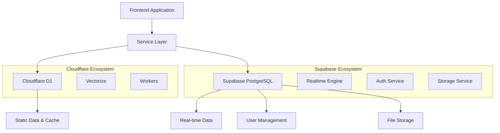

# 📚 System Architecture Documentation - MA Malnu Kananga

## 🌟 Overview

MA Malnu Kananga School Portal is built on a modern, serverless architecture designed for scalability, performance, and reliability. This document provides comprehensive technical details about the system architecture, components, and design decisions.

---

## 🏗️ High-Level Architecture

### Architecture Diagram
```
┌─────────────────┐    ┌─────────────────┐    ┌─────────────────┐
│   Frontend      │    │   Cloudflare    │    │   External      │
│   (React +      │◄──►│   Workers       │◄──►│   Services      │
│   TypeScript)   │    │   (Backend)     │    │   (Google AI)   │
└─────────────────┘    └─────────────────┘    └─────────────────┘
         │                       │                       │
         │              ┌─────────────────┐              │
         │              │   Cloudflare    │              │
         └──────────────►│   D1 Database   │◄─────────────┘
                        │   (SQLite)      │
                        └─────────────────┘
                                 │
                        ┌─────────────────┐
                        │   Cloudflare    │
                        │   Vectorize     │
                        │   (Vector DB)   │
                        └─────────────────┘
```

### Core Principles
- **Serverless First**: All backend services run on Cloudflare Workers
- **Edge Computing**: Global distribution for low latency
- **JAMstack**: JavaScript, APIs, and Markup architecture
- **Progressive Enhancement**: Core functionality works without JavaScript
- **Mobile-First**: Responsive design with PWA capabilities

---

## 🎨 Frontend Architecture

### Technology Stack
- **React 19.2**: Modern React with concurrent features
- **TypeScript 5.9**: Strict type safety and developer experience
- **Vite 7.2**: Ultra-fast build tool and development server
- **Tailwind CSS 4.1**: Utility-first CSS framework
- **React Query**: Server state management and caching
- **PWA**: Progressive Web App capabilities

### Component Architecture
```
src/
├── components/           # Reusable UI components
│   ├── common/          # Generic components (Button, Modal, etc.)
│   ├── forms/           # Form-specific components
│   ├── layout/          # Layout and navigation components
│   └── features/        # Feature-specific components
├── pages/               # Route-level components
├── hooks/               # Custom React hooks
├── services/            # API service layer
├── utils/               # Utility functions
├── types/               # TypeScript type definitions
└── assets/              # Static assets
```

### State Management Strategy
- **Local State**: React useState for component state
- **Server State**: React Query for API data and caching
- **Global State**: React Context for authentication and theme
- **Form State**: React Hook Form for form management
- **URL State**: URL parameters for routing and filters

### Performance Optimizations
- **Code Splitting**: Lazy loading with React.lazy()
- **Tree Shaking**: Unused code elimination
- **Bundle Analysis**: Regular bundle size monitoring
- **Image Optimization**: WebP format with fallbacks
- **Caching Strategy**: Service worker for offline support

---

## ⚙️ Backend Architecture

### Cloudflare Workers
- **Runtime**: V8 isolates with sub-millisecond startup
- **Language**: JavaScript/ES2022 with TypeScript support
- **Memory**: 128MB per worker with CPU time limits
- **Global Distribution**: 200+ edge locations worldwide
- **Zero Cold Starts**: Instant response times

### Worker Structure
```javascript
// worker.js - Main entry point
export default {
  async fetch(request, env, ctx) {
    // Request routing and handling
  },
  async scheduled(event, env, ctx) {
    // Scheduled tasks and maintenance
  }
};

// Services/
├── authService.js       # Authentication and authorization
├── geminiService.js     # AI integration
├── vectorService.js     # Vector database operations
├── databaseService.js   # D1 database operations
└── messagingService.js  # Email and notifications
```

### Database Architecture

#### Cloudflare D1 (SQLite)
- **Type**: Serverless SQL database
- **Compatibility**: SQLite 3.39+
- **Performance**: Sub-millisecond query response
- **Scalability**: Automatic scaling with usage
- **Replication**: Multi-region replication

#### Schema Design
```sql
-- Users table
CREATE TABLE users (
  id INTEGER PRIMARY KEY,
  email TEXT UNIQUE NOT NULL,
  name TEXT NOT NULL,
  role TEXT NOT NULL CHECK (role IN ('student', 'teacher', 'parent', 'admin')),
  created_at DATETIME DEFAULT CURRENT_TIMESTAMP,
  updated_at DATETIME DEFAULT CURRENT_TIMESTAMP
);

-- Academic records
CREATE TABLE grades (
  id INTEGER PRIMARY KEY,
  student_id INTEGER REFERENCES users(id),
  subject TEXT NOT NULL,
  semester TEXT NOT NULL,
  uts INTEGER CHECK (uts >= 0 AND uts <= 100),
  uas INTEGER CHECK (uas >= 0 AND uas <= 100),
  tugas INTEGER CHECK (tugas >= 0 AND tugas <= 100),
  created_at DATETIME DEFAULT CURRENT_TIMESTAMP
);

-- Attendance tracking
CREATE TABLE attendance (
  id INTEGER PRIMARY KEY,
  student_id INTEGER REFERENCES users(id),
  date DATE NOT NULL,
  status TEXT NOT NULL CHECK (status IN ('present', 'sick', 'permission', 'absent')),
  notes TEXT,
  created_at DATETIME DEFAULT CURRENT_TIMESTAMP
);
```

### Supabase Integration Architecture

#### Hybrid Database Approach
MA Malnu Kananga menggunakan **dual database architecture** untuk optimalisasi performa dan fitur:



#### Supabase PostgreSQL
- **Type**: Managed PostgreSQL database
- **Version**: PostgreSQL 15+
- **Features**: Real-time subscriptions, Row Level Security (RLS)
- **Integration**: REST API, GraphQL API, Realtime WebSocket
- **Use Cases**: User management, real-time collaboration, file storage

#### Supabase Service Integration
```typescript
// Service files in src/services/
├── supabase/
│   ├── supabaseClient.ts     # Supabase client configuration
│   ├── supabaseApiService.ts # API service layer
│   ├── supabaseAuthService.ts # Authentication service
│   └── supabaseStorage.ts    # File storage service
```

#### Data Distribution Strategy
| Data Type | Storage | Reason |
|-----------|---------|--------|
| **User Authentication** | Supabase | Advanced auth features, social login |
| **Real-time Chat** | Supabase | WebSocket support, real-time sync |
| **File Uploads** | Supabase Storage | CDN integration, image optimization |
| **Academic Records** | Cloudflare D1 | Fast read operations, edge caching |
| **Static Content** | Cloudflare D1 | Global distribution, low latency |
| **AI Vector Data** | Cloudflare Vectorize | Specialized vector operations |

#### Service Communication
```typescript
// Example: Hybrid service usage
class HybridDataService {
  // Use D1 for fast academic data
  async getStudentGrades(studentId: string) {
    return await this.d1Service.query(
      'SELECT * FROM grades WHERE student_id = ?', [studentId]
    );
  }
  
  // Use Supabase for real-time features
  async subscribeToChatUpdates(chatId: string) {
    return await this.supabaseClient
      .channel(`chat:${chatId}`)
      .on('postgres_changes', { event: 'INSERT', schema: 'public' }, payload => {
        this.handleNewMessage(payload.new);
      })
      .subscribe();
  }
}
```

### Vector Database Architecture

#### Cloudflare Vectorize
- **Dimensions**: 768 (compatible with embedding models)
- **Metric**: Cosine similarity for semantic search
- **Indexing**: HNSW (Hierarchical Navigable Small World)
- **Performance**: Millisecond vector similarity search

#### Vector Schema
```javascript
// Document structure for vectorization
{
  id: "doc_123",
  text: "Program unggulan sains MA Malnu Kananga...",
  metadata: {
    category: "academic",
    language: "id",
    priority: "high",
    last_updated: "2024-11-20"
  },
  values: [0.1, 0.2, 0.3, ...] // 768-dimensional vector
}
```

---

## 🤖 AI System Architecture

### RAG (Retrieval-Augmented Generation)
```
User Query → Embedding → Vector Search → Context Retrieval → Prompt Engineering → AI Generation → Response
```

### Components
1. **Query Processing**: Natural language understanding
2. **Embedding Generation**: Text to vector conversion
3. **Similarity Search**: Find relevant context
4. **Context Assembly**: Build prompt with retrieved context
5. **AI Generation**: Generate response with Google Gemini
6. **Response Formatting**: Structure and present answer

### AI Integration
- **Provider**: Google Gemini AI (gemini-1.5-flash)
- **Model**: 1.5 Flash for fast responses
- **Language**: Indonesian optimization
- **Context Window**: 32K tokens
- **Rate Limits**: 60 requests per minute

### Knowledge Base
- **School Information**: Programs, facilities, policies
- **Academic Data**: Curriculum, schedules, requirements
- **FAQ Database**: Common questions and answers
- **Dynamic Content**: News, announcements, events

---

## 🔐 Security Architecture

### Authentication System
- **Method**: Magic Link (passwordless)
- **Token**: JWT with HMAC-SHA256 signing
- **Expiry**: 15 minutes for magic links
- **Storage**: HTTP-only cookies for session tokens

### Security Layers
1. **Network Security**: HTTPS with TLS 1.3
2. **Application Security**: Input validation and sanitization
3. **Data Security**: Encryption at rest and in transit
4. **Access Control**: Role-based permissions
5. **Audit Logging**: Comprehensive activity tracking

### Rate Limiting
- **Authentication**: 5 requests per 15 minutes per IP
- **API Calls**: No limit for authenticated users
- **AI Requests**: 60 requests per minute per user
- **File Uploads**: 10MB limit per file

### Data Protection
- **Encryption**: AES-256 for sensitive data
- **Hashing**: bcrypt for password hashes (legacy)
- **Tokens**: JWT with short expiry
- **Compliance**: GDPR and Indonesian data protection laws

---

## 📱 PWA Architecture

### Service Worker Strategy
```javascript
// Cache strategy
const CACHE_STRATEGIES = {
  STATIC: 'cache-first',      // Static assets
  API: 'network-first',       // API calls
  DYNAMIC: 'stale-while-revalidate' // Dynamic content
};

// Cache names
const CACHES = {
  STATIC: 'static-v1.1.0',
  API: 'api-v1.1.0',
  DYNAMIC: 'dynamic-v1.1.0'
};
```

### Offline Capabilities
- **Core Features**: Dashboard, schedules, profiles
- **Caching**: Intelligent cache management
- **Sync**: Background sync for data updates
- **Storage**: IndexedDB for local data persistence

### App Installation
- **Criteria**: User engagement and site visits
- **Prompt**: Native installation prompt
- **Icon**: Adaptive icons for all platforms
- **Manifest**: Complete PWA manifest configuration

---

## 🚀 Deployment Architecture

### Infrastructure Components
1. **Cloudflare Pages**: Frontend hosting and CDN
2. **Cloudflare Workers**: Backend API and logic
3. **Cloudflare D1**: Primary database
4. **Cloudflare Vectorize**: Vector database
5. **Cloudflare R2**: File storage (future)

### Deployment Pipeline
```
Git Push → GitHub Actions → Build & Test → Deploy to Staging → Run Tests → Deploy to Production → Health Checks
```

### Environment Configuration
- **Development**: Local development with mock data
- **Staging**: Production-like environment for testing
- **Production**: Live environment with real data

### CI/CD Pipeline
- **Triggers**: Push to main branch, pull requests
- **Steps**: Lint, test, build, deploy, verify
- **Rollback**: Automatic rollback on failure
- **Monitoring**: Real-time deployment monitoring

---

## 📊 Monitoring & Analytics

### Performance Monitoring
- **Lighthouse CI**: Automated performance testing
- **Core Web Vitals**: Real user monitoring
- **Error Tracking**: Sentry integration
- **Uptime Monitoring**: 24/7 service availability

### Analytics Implementation
- **User Behavior**: Page views, feature usage
- **Performance Metrics**: Load times, error rates
- **Business Metrics**: User engagement, retention
- **System Health**: Resource utilization, response times

### Logging Strategy
```javascript
// Structured logging format
{
  timestamp: "2024-11-20T10:30:00Z",
  level: "info",
  service: "auth",
  message: "User login successful",
  user_id: 123,
  ip: "192.168.1.1",
  request_id: "req_123456",
  duration: 150
}
```

---

## 🔧 Development Workflow

### Local Development
- **Environment**: Node.js 18+ with npm
- **Server**: Vite dev server with HMR
- **Database**: Local SQLite with migrations
- **Testing**: Jest with React Testing Library

### Code Quality
- **Linting**: ESLint with TypeScript rules
- **Formatting**: Prettier with consistent config
- **Type Checking**: Strict TypeScript mode
- **Testing**: 90%+ coverage requirement

### Git Workflow
- **Branching**: Feature branches from main
- **Commits**: Conventional commit format
- **PRs**: Required code review
- **Merges**: Squash merge to main

---

## 🌐 API Architecture

### RESTful Design
- **Base URL**: `https://malnu-api.sulhi-cmz.workers.dev`
- **Version**: v1 with backward compatibility
- **Format**: JSON with consistent error handling
- **Documentation**: OpenAPI 3.0 specification

### API Categories
1. **Authentication**: Magic link system
2. **AI Chat**: RAG-powered assistant
3. **Academic**: Grades, schedules, attendance
4. **Content**: News, announcements, programs
5. **Messaging**: Internal communication
6. **Analytics**: Usage statistics and reports

### Response Format
```json
{
  "success": true,
  "data": { ... },
  "message": "Operation successful",
  "timestamp": "2024-11-20T10:30:00Z",
  "request_id": "req_123456"
}
```

---

## 📈 Scalability Architecture

### Horizontal Scaling
- **Workers**: Auto-scaling with demand
- **Database**: Read replicas for query distribution
- **CDN**: Global edge caching
- **Load Balancing**: Automatic traffic distribution

### Performance Optimization
- **Caching**: Multi-level caching strategy
- **Compression**: Gzip/Brotli compression
- **Minification**: Code and asset optimization
- **Lazy Loading**: On-demand resource loading

### Resource Management
- **Memory**: Efficient memory usage patterns
- **CPU**: Optimized algorithms and data structures
- **Network**: Minimized API calls and data transfer
- **Storage**: Efficient data storage and retrieval

---

## 🔄 Integration Architecture

### Third-Party Services
- **Google AI**: Gemini API for AI features
- **MailChannels**: Email delivery service
- **Cloudflare**: Infrastructure provider
- **GitHub**: Version control and CI/CD

### Integration Patterns
- **Webhooks**: Event-driven communication
- **REST APIs**: Synchronous data exchange
- **Message Queues**: Asynchronous processing
- **WebSockets**: Real-time communication

### Data Synchronization
- **Real-time**: WebSocket connections
- **Batch**: Scheduled synchronization jobs
- **Event-driven**: Trigger-based updates
- **Conflict Resolution**: Last-write-wins strategy

---

## 🚨 Disaster Recovery

### Backup Strategy
- **Database**: Daily automated backups
- **Files**: Version-controlled assets
- **Configuration**: Infrastructure as code
- **Recovery**: Point-in-time restoration

### High Availability
- **Redundancy**: Multi-region deployment
- **Failover**: Automatic service failover
- **Monitoring**: Health checks and alerts
- **Recovery**: Rapid recovery procedures

### Security Incidents
- **Detection**: Real-time threat monitoring
- **Response**: Incident response procedures
- **Communication**: Stakeholder notifications
- **Post-mortem**: Incident analysis and improvement

---

## 📋 Future Architecture Plans

### Short-term (Q1 2025)
- **Microservices**: Split monolithic worker
- **Event Sourcing**: Implement event-driven architecture
- **CQRS**: Command Query Responsibility Segregation
- **Advanced Caching**: Redis integration

### Medium-term (Q2-Q3 2025)
- **GraphQL**: API query language
- **gRPC**: High-performance RPC framework
- **Event Store**: Dedicated event storage
- **Message Broker**: Apache Kafka or similar

### Long-term (Q4 2025+)
- **Multi-tenant**: Support for multiple schools
- **Edge Computing**: Advanced edge processing
- **AI/ML**: Custom model training
- **Blockchain**: Academic credential verification

---

## 📚 Documentation Standards

### Architecture Documentation
- **Diagrams**: C4 model architecture diagrams
- **API Docs**: OpenAPI 3.0 specifications
- **Runbooks**: Operational procedures
- **Standards**: Coding and design standards

### Knowledge Management
- **Wiki**: Internal documentation
- **Code Comments**: Comprehensive inline documentation
- **Architecture Decision Records**: ADR documentation
- **Training**: Regular team training sessions

---

**System Architecture Documentation**  
*Version: 1.3.0*  
*Last Updated: November 24, 2024*  
*Architecture Team: MA Malnu Kananga Development Team*  
*Next Review: December 2024*

---

*For technical questions or architecture discussions, please contact the development team at dev@ma-malnukananga.sch.id*