# 📊 Optimization Implementation Flow Diagram

```mermaid
graph TB
    %% Current State
    A[Current Application<br/>✅ Core Features Complete<br/>❌ No Performance Optimization<br/>❌ Basic UX]

    %% Phase 1: Foundation
    B[Phase 1: Foundation<br/>📦 Bundle Analysis Setup<br/>⚠️ Error Boundaries<br/>🔍 Basic SEO]

    %% Phase 2: Performance
    C[Phase 2: Performance<br/>🖼️ Image Optimization<br/>📦 Code Splitting<br/>🔄 API Caching]

    %% Phase 3: UX Enhancement
    D[Phase 3: UX Enhancement<br/>🧭 Navigation Enhancement<br/>⏳ Loading States<br/>♿ Accessibility]

    %% Phase 4: Quality & Features
    E[Phase 4: Quality & Features<br/>🧹 Code Cleanup<br/>📱 PWA Features<br/>📊 Analytics]

    %% Final State
    F[Final Optimized Application<br/>🚀 Performance Optimized<br/>🎨 UX Enhanced<br/>♿ Accessible<br/>📱 PWA Ready]

    %% Dependencies
    A --> B
    B --> C
    C --> D
    D --> E
    E --> F

    %% Parallel tasks
    B -.->|Can run parallel| D
    C -.->|Can run parallel| E

    %% Critical path
    A -.->|Critical| C
    C -.->|Critical| F
```

## 🎯 Implementation Strategy

### Critical Path (Must be Sequential)
1. **Bundle Analysis** → Foundation untuk semua optimizations
2. **Code Splitting** → Basis untuk performance improvements
3. **PWA Core** → Essential untuk offline functionality

### Parallel Tasks (Can be Simultaneous)
1. **Error Boundaries** + **Loading States** (UX enhancement)
2. **Image Optimization** + **Component Cleanup** (Performance)
3. **Navigation Enhancement** + **Accessibility** (UX improvement)

## 📈 Success Metrics by Phase

| Phase | Performance | Accessibility | Bundle Size | UX Score |
|-------|-------------|----------------|-------------|----------|
| **Current** | Baseline | ~60% | ~800KB | 70% |
| **Phase 1** | +10% | +15% | -5% | +10% |
| **Phase 2** | +35% | +10% | -40% | +15% |
| **Phase 3** | +10% | +20% | -10% | +25% |
| **Phase 4** | +5% | +5% | -5% | +10% |
| **Target** | **60%** | **>95%** | **<500KB** | **>90%** |

## 🚀 Quick Wins vs Long-term Benefits

### Quick Wins (Week 1)
- ❌ Remove console.logs (immediate size reduction)
- ✅ Bundle analyzer setup (visibility into optimizations)
- ✅ Error boundaries (immediate UX improvement)
- ✅ Basic SEO meta tags (immediate SEO benefit)

### Medium-term (Week 2-3)
- ✅ Image lazy loading (significant performance boost)
- ✅ Code splitting (major bundle size reduction)
- ✅ React Query integration (API performance)
- ✅ Navigation enhancement (UX improvement)

### Long-term (Week 4+)
- ✅ PWA implementation (advanced features)
- ✅ Advanced analytics (monitoring & insights)
- ✅ Accessibility audit (compliance)
- ✅ Performance monitoring (continuous improvement)

## 🔧 Technical Debt Reduction

### Current Technical Debt
- **High**: Large component files (384+ lines)
- **Medium**: No error handling strategy
- **Medium**: No performance monitoring
- **Low**: Mock data dependencies

### Debt Reduction Strategy
1. **Component Splitting**: Break down large components
2. **Error Handling**: Comprehensive error boundaries
3. **Performance Monitoring**: Web Vitals tracking
4. **Mock Data**: Gradual replacement dengan real APIs

## 📊 Risk Assessment

### High Risk Items
- **Bundle Splitting**: Could break existing functionality
- **PWA Implementation**: Complex service worker logic
- **Analytics Integration**: Privacy compliance requirements

### Mitigation Strategies
- **Gradual Rollout**: Feature flags untuk new features
- **Comprehensive Testing**: Unit + integration tests
- **Fallback Mechanisms**: Graceful degradation
- **User Testing**: Beta testing dengan actual users

## 🎯 Definition of Done

### Per Phase
- **Phase 1**: Bundle analyzer working, error boundaries implemented, basic SEO added
- **Phase 2**: 40% bundle size reduction, image optimization complete, API caching working
- **Phase 3**: Navigation working, loading states implemented, accessibility > 90%
- **Phase 4**: PWA installable, analytics tracking, code coverage > 80%

### Final Application
- **Performance**: Lighthouse > 90 all categories
- **Accessibility**: WCAG 2.1 AA compliant
- **SEO**: Rich snippets dan meta tags
- **PWA**: Installable dengan offline support
- **Monitoring**: Error tracking dan performance metrics